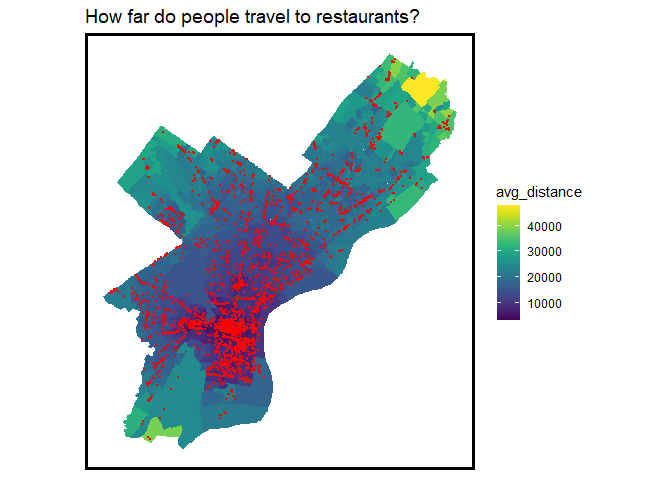
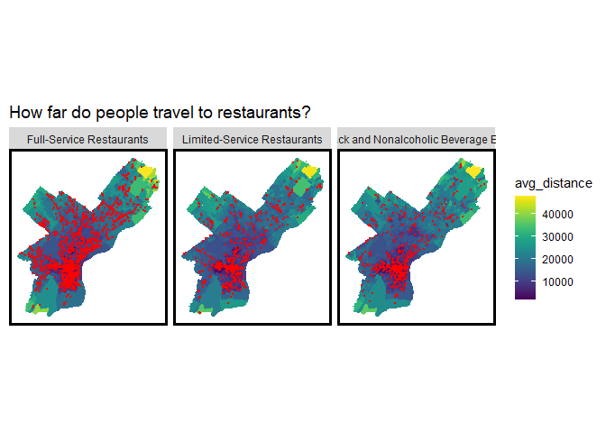

Exploratory Analysis
================
Maddy Kornhauser, Sabrina Lee, Brian Rawn
2/4/2021

# Class 2/9/2021

## General Updates

  - Connected with Andrew last week and are coordinating on some
    additional data (2019 moves, normalization information).
  - Refined our use case.
  - Looked into using Yelp data.
  - Begun exploratory analysis.

## Use Case

Last week, our use case was focused on the causal effects of nightlife.
Not only is this very difficult to measure, there are a number of
problems associated with underlying bias in data we would use to measure
negative externalties.

This week, we have split our use case into two parts - one to frame our
exploratory analysis, and a second (WIP) to frame the public policy tool
we will ultimately buid.

  - *Exploratory analysis use case*: How does the location of nightlife
    establishments impact foot traffic in Philadelphia?

  - *Public policy use case*: How far are people willing to travel for
    nightlife establishments? How much foot traffic can we expect in a
    given nightlife corridor?

By developing a tool to measure how nightlife establishments impact foot
traffic (a proxy for commercial activity), community groups and councils
can quickly ascertain the demand for nightlife in certain areas of
Philadelphia. This tool will help stakeholders make informed decisions
when siting and issuing permits and licenses for future nightlife
establishments.

## Yelp data

There is a [Yelp Open Dataset](https://www.yelp.com/dataset) with a
subset of businesses, reviews and user data that is available for
academic purposes. Unfortunately, this data is only availabe for a
selection of cities that do not include Philadelphia.

Alternatively, we can plug into the Yelp API and pull Philadelphia data
meeting various search criteria. Based on online articles (see
[here](https://billpetti.github.io/2017-12-23-use-yelp-api-r-rstats/)
and [here](https://rpubs.com/fitzpatrickm8/yelpapi)) we wrote a script
that can queries the Yelp API. This is also saved on the repo. There are
some limitations:

  - It appears that you cannot pull more than 50 search results at a
    time based on a search term.
  - It’s not clear how search results are ordered.
  - How would we match this up against the SafeGraph data? There is
    coordinate infromation and names of stores, but we can forsee some
    issues here.
  - Like the 311 and crime data, we have to consider the underying bias
    of the Yelp data. Is this reliable?

## Exploratory Analysis

This week, we have focused on exploring the 2018 SafeGraph dataset and
answering the following questions.

  - Where and how far are people travelling from?
  - When are people travelling?
  - What is the number of visits/visitors? Is there seasonality in the
    mobility patterns? Weekly patterns?
  - Where does nightlife happen?
  - Where are the major nightlife corridors?
  - How long do people spend in establishments? What is the median dwell
    time?

### Setup

### Where and how far are people travelling from?

The following maps break down the count of different CBGs by point of
interest and sectors that contribute to the nighttime economy. Looking
first at restaurants, we see that locations that attract the most CBGs
are located primarily in Center City and along transit lines. Because of
so many restaurants, we have shown a map during summer and winter.

``` r
dat_cbg_visitors <- 
  dat2 %>%
  select(safegraph_place_id, date_range_start, top_category, sub_category, poi_cbg, visitor_home_cbgs, geometry) %>%
  mutate(visitor_home_cbgs = str_remove_all(visitor_home_cbgs, pattern = "\\[|\\]")) %>%
  mutate(visitor_home_cbgs = str_remove_all(visitor_home_cbgs, pattern = "\\{|\\}")) %>%
  mutate(visitor_home_cbgs = str_remove_all(visitor_home_cbgs, pattern = '\\"|\\"')) %>%
  mutate(visitor_home_cbgs = str_split(visitor_home_cbgs, pattern = ",")) %>%
  unnest(visitor_home_cbgs) %>%
  separate(.,
           visitor_home_cbgs,
           c("Visitor_CBG", "Visitors"),
           sep = ":") %>%
  mutate(Visitor_CBG = as.numeric(Visitor_CBG),
         poi_cbg = as.numeric(poi_cbg),
         Visitors = as.numeric(Visitors))

#Restaurants
restaurants_cbg_jan <- 
  dat_cbg_visitors %>%
  filter(top_category == "Restaurants and Other Eating Places",
         date_range_start == "2018-01-01T05:00:00Z") %>%
  group_by(safegraph_place_id) %>%
  summarize(Count = n()) %>%
  ggplot() + 
  geom_sf(data = phl_cbg, fill = "grey40", color = "transparent") +
  geom_sf(aes(color = q5(Count)), size = .5) + 
  scale_fill_manual(values = palette5,
                    aesthetics = c("colour", "fill"),
                    name = "CBG Count\nQuintile Breaks") +
  mapTheme() +
  labs(title = "How many different CBGs visit \neach restaurant? (January)")

restaurants_cbg_jul <- 
  dat_cbg_visitors %>%
  filter(top_category == "Restaurants and Other Eating Places",
         date_range_start == "2018-07-01T04:00:00Z") %>%
  group_by(safegraph_place_id) %>%
  summarize(Count = n()) %>%
  ggplot() +
  geom_sf(data = phl_cbg, fill = "grey40", color = "transparent") +
  geom_sf(aes(color = q5(Count)), size = .5) +
  scale_fill_manual(values = palette5,
                    aesthetics = c("colour", "fill"),
                    name = "CBG Count\nQuintile Breaks") +
  mapTheme() +
  labs(title = "How many different CBGs visit \neach restaurant (July)?")

grid.arrange(restaurants_cbg_jan, restaurants_cbg_jul, nrow = 1)
```

<!-- -->

The following maps look at the number of CBGs per location for bars and
concert/performance venues.

``` r
#Bars
bars_cbg <-
  dat_cbg_visitors %>%
  filter(top_category == "Drinking Places (Alcoholic Beverages)") %>%
  group_by(safegraph_place_id) %>%
  summarize(Count = n()) %>%
  ggplot() +
  geom_sf(data = phl_cbg, fill = "grey40", color = "transparent") +
  geom_sf(aes(color = q5(Count)), size = 1) + 
  scale_fill_manual(values = palette5,
                    aesthetics = c("colour", "fill"),
                    name = "CBG Count\nQuintile Breaks") +
  mapTheme() +
  labs(title = "How many different CBGs visit bars?")

#Concert Venues
concert_cbg <-
  dat_cbg_visitors %>%
  filter(top_category == "Promoters of Performing Arts, Sports, and Similar Events" |
           top_category == "Performing Arts Companies") %>%
  group_by(safegraph_place_id) %>%
  summarize(Count = n()) %>%
  ggplot() +
  geom_sf(data = phl_cbg, fill = "grey40", color = "transparent") +
  geom_sf(aes(color = q5(Count)), size = 1) + 
  scale_fill_manual(values = palette5,
                    aesthetics = c("colour", "fill"),
                    name = "CBG Count\nQuintile Breaks") +
  mapTheme() +
  labs(title = "How many different CBGs visit \nconcert venues and performing arts venues?")

grid.arrange(bars_cbg, concert_cbg, nrow = 1)
```

<!-- -->

### When are people travelling?

The following charts looks at the average visits by day in restaurants
and other eating places. This shows the patterns for each of the
subcategory under restaurant.

We see an increase throughout the week until Friday and then decreased
traffic over the weekend. This likely reflects the workforce that isn’t
coming into the city over the weekends.

``` r
dat_day <- 
  dat2 %>% 
  select(safegraph_place_id, top_category, sub_category, popularity_by_day) %>%
  mutate(popularity_by_day = str_remove_all(popularity_by_day, pattern = "\\[|\\]")) %>%
  mutate(popularity_by_day = str_remove_all(popularity_by_day, pattern = "\\{|\\}")) %>%
  mutate(popularity_by_day = str_remove_all(popularity_by_day, pattern = '\\"|\\"')) %>% 
  mutate(popularity_by_day = str_split(popularity_by_day, pattern = ",")) %>%
  unnest(popularity_by_day) %>%
  separate(.,
           popularity_by_day,
           c("Day", "Visits"),
           sep = ":") %>%
  mutate(Visits = as.numeric(Visits))

week_order = c("Monday", "Tuesday", "Wednesday", "Thursday", "Friday", "Saturday", "Sunday")

dat_day %>%
  filter(top_category == "Restaurants and Other Eating Places") %>%
  group_by(sub_category, Day) %>%
  summarize(Avg_Visits = mean(Visits)) %>%
  mutate(Day = factor(Day, levels = week_order)) %>% arrange(Day) %>% #order by day of the week
  ggplot(., aes(x = Day, y = Avg_Visits)) + 
  geom_col() +
  facet_wrap(~sub_category)
```

<!-- -->

The same metric for bars (there are no sub-categories).

``` r
dat_day %>%
  filter(top_category == "Drinking Places (Alcoholic Beverages)") %>%
  group_by(sub_category, Day) %>%
  summarize(Avg_Visits = mean(Visits)) %>%
  mutate(Day = factor(Day, levels = week_order)) %>% arrange(Day) %>% #order by day of the week
  ggplot(., aes(x = Day, y = Avg_Visits)) + 
  geom_col() +
  facet_wrap(~sub_category)
```

<!-- -->

And for performing arts centers and companies.

``` r
dat_day %>%
  filter(top_category == "Promoters of Performing Arts, Sports, and Similar Events" |
           top_category == "Performing Arts Companies") %>%
  group_by(top_category, Day) %>%
  summarize(Avg_Visits = mean(Visits)) %>%
  mutate(Day = factor(Day, levels = week_order)) %>% arrange(Day) %>% #order by day of the week
  ggplot(., aes(x = Day, y = Avg_Visits)) + 
  geom_col() +
  facet_wrap(~top_category)
```

<!-- -->

Turning to traffic by hour of the day, the following chart shows foot
average foot traffic in restaurants. We have split them out by
sub-category. At this level, it appears that most restaurant traffic
does not occur at night, but rather in the middle of the day.

``` r
dat_hour <- 
  dat2 %>% 
  select(safegraph_place_id, top_category, sub_category, popularity_by_hour) %>%
  mutate(popularity_by_hour = str_remove_all(popularity_by_hour, pattern = "\\[|\\]")) %>%
  unnest(popularity_by_hour) %>%
  separate(.,
           popularity_by_hour,
           c("0", "1", "2", "3", "4", "5", "6", 
             "7", "8", "9", "10", "11", "12", 
             "13", "14", "15", "16", "17", "18",
             "19", "20", "21", "22", "23"),
           sep = ",") %>%
  pivot_longer(cols = 4:27,
               names_to = "Hour",
               values_to = "Count") %>%
  mutate(Hour = as.numeric(Hour),
         Count = as.numeric(Count))

#Restaurants
dat_hour %>%
  filter(top_category == "Restaurants and Other Eating Places") %>%
  group_by(sub_category, Hour) %>%
  summarize(Avg_Visits = mean(Count)) %>%
  ggplot(., aes(x = Hour, y = Avg_Visits)) + 
  geom_col() +
  facet_wrap(~sub_category)
```

<!-- -->

We have also include the same metric for bars, which show a stronger
pattern towards nighttime traffic.

``` r
#Bars
dat_hour %>%
  filter(top_category == "Drinking Places (Alcoholic Beverages)") %>%
  group_by(sub_category, Hour) %>%
  summarize(Avg_Visits = mean(Count)) %>%
  ggplot(., aes(x = Hour, y = Avg_Visits)) + 
  geom_col() +
  labs(title = "Average Traffic by Hour in Philadelphia Bars")
```

<!-- -->

Same for concert venues and performing arts spaces, which have a high
amount of traffic in the evening and early morning hours.

``` r
#Concert Venues
dat_hour %>%
  filter(top_category == "Promoters of Performing Arts, Sports, and Similar Events" |
           top_category == "Performing Arts Companies") %>%
  group_by(top_category, Hour) %>%
  summarize(Avg_Visits = mean(Count)) %>%
  ggplot(., aes(x = Hour, y = Avg_Visits)) + 
  geom_col() +
  facet_wrap(~top_category)
```

<!-- -->

### Number of visits/vistors. Seasonality/weekly patterns?

\[TBD\]

### Where does nightlife happen?

``` r
#Census Block Groups
dat_cbg2 <-
  dat %>%
  select(safegraph_place_id,
         poi_cbg, 
         raw_visit_counts, 
         raw_visitor_counts, 
         median_dwell, 
         distance_from_home)%>%
  rename(., GEOID10 = poi_cbg) %>%
  group_by(GEOID10) %>%
  summarize(Avg_Visits = mean(raw_visit_counts),
            Avg_Visitors = mean(raw_visitor_counts),
            Total_Visits = sum(raw_visit_counts),
            Total_Visitors = sum(raw_visitor_counts),
            Avg_Dwell = mean(median_dwell),
            Avg_DistHome = mean(distance_from_home)) %>%
  left_join(phl_cbg) %>% 
  st_as_sf() %>%
  mutate(Visits_Per_Area = Total_Visits / Shape__Area) %>%
  mutate(Visitors_Per_Area = Total_Visitors / Shape__Area)
```

    ## `summarise()` ungrouping output (override with `.groups` argument)

    ## Joining, by = "GEOID10"

``` r
dat_cbg2 %>%
  subset(Total_Visits < 1900000) %>% #removing outliers to see patterns in the data
  ggplot() + 
  geom_sf(data = phl_cbg, fill = "grey40", color = "transparent") +
  geom_sf(aes(fill = Total_Visits), color = "transparent") + 
  scale_fill_viridis() +
  labs(title = "Total SafeGraph Visits by CBG")
```

<!-- -->

``` r
dat_cbg2 %>%
  subset(Total_Visitors < 1900000) %>% #removing outliers to see patterns in the data
  ggplot() + 
  geom_sf(data = phl_cbg, fill = "grey40", color = "transparent") +
  geom_sf(aes(fill = Total_Visits), color = "transparent") + 
  scale_fill_viridis() +
  labs(title = "Total SafeGraph Visitors by CBG")
```

<!-- -->

``` r
dat_cbg2 %>%
  #subset(Avg_Visits < 1500) %>% #removing outliers to see patterns in the data
  ggplot() + 
  geom_sf(data = phl_cbg, fill = "grey40", color = "transparent") +
  geom_sf(aes(fill = Visits_Per_Area), color = "transparent") + 
  scale_fill_viridis() +
  labs(title = "Total SafeGraph Visits by CBG, Adjusted by CBG Area")
```

<!-- -->

``` r
dat_cbg2 %>%
  #subset(Avg_Visits < 1500) %>% #removing outliers to see patterns in the data
  ggplot() + 
  geom_sf(data = phl_cbg, fill = "grey40", color = "transparent") +
  geom_sf(aes(fill = Visitors_Per_Area), color = "transparent") + 
  scale_fill_viridis() +
  labs(title = "Total SafeGraph Visitors by CBG, Adjusted by CBG Area")
```

<!-- -->

### What are the major nightlife corridors?

\[TBD\]

### How long do people spend in establishments?

\[TBD\]
