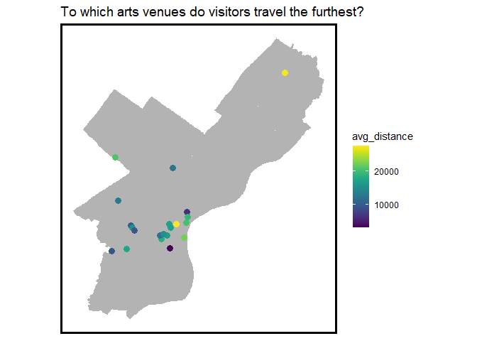
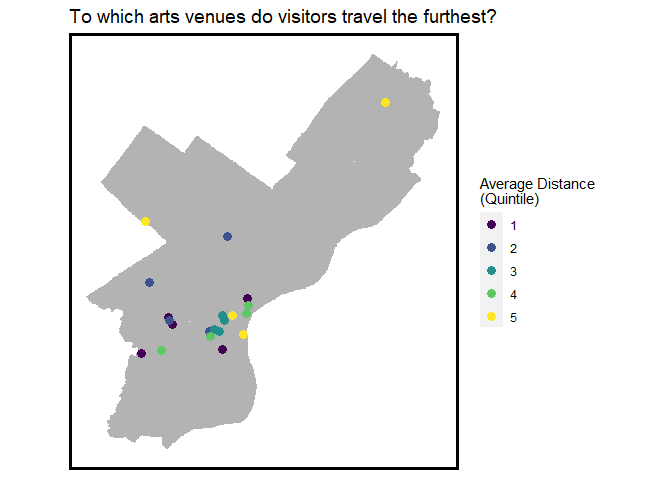
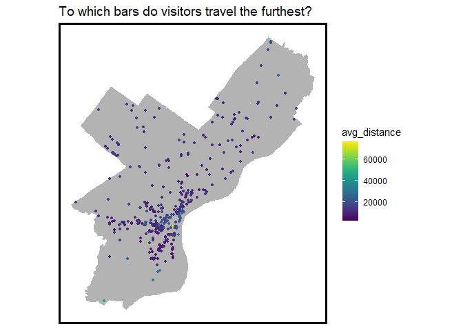
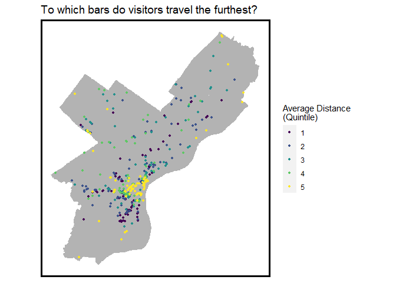
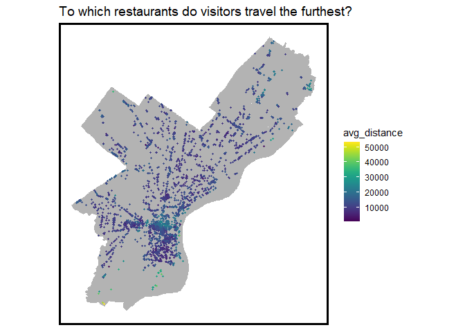
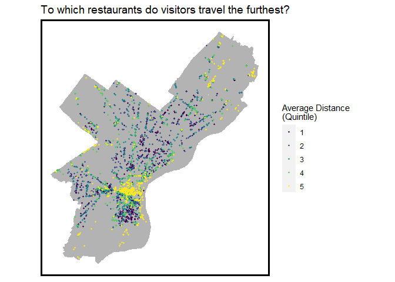
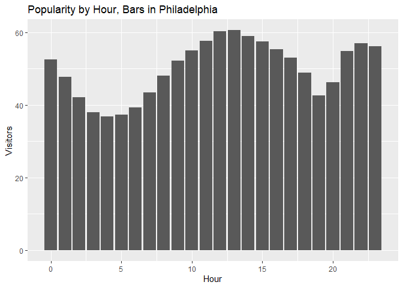

Exploratory Analysis
================
Maddy Kornhauser, Sabrina Lee, Brian Rawn
2/4/2021

# Class 2/16/2021

## General Updates

  - Discussed SafeGraph data accuracy with Eugene.
  - Further refined use case.
  - Continued exploratory analysis:
      - Origins & destination analysis
      - Identifying clusters of nightlife in Philadelphia
      - Nightlife’s relationship to transit
      - Developing graphics and animations to visualize time
  - Meetng with Kae Anderson of the Fishtown BID.
  - Outstanding questions:
      - How to evaluate quality?
      - How have foot traffic patterns have changed due to COVID?

## SafeGraph Accuracy

Last week, we realized that the data tended to show people regularly
visiting establishments during very early morning hours (e.g. full
service restaurants showing traffic at 3 and 4 in the morning). This
didn’t seem quite right to us, so we reached out to Eugene to get more
information on how visitors are counted.

*Key takeaways from the discusison:*

  - SafeGraph data relies on GPS signals and is inherently noisy. We
    should not attribute a high-level of precision to the data,
    particularly in an urban setting.
  - Visits in the early morning hours could be people living close by or
    above the location.
  - Visit count won’t be an accurate summary of how many people are
    there. Instead, it is better to look at relative popularity of a
    destination.
  - Suggested strategies for working with this data:
      - Aggregate at the corridor or neighborhood level.
      - Remove visitors who stay for a very long time.
      - Compare relative percentages.

While this information didn’t directly impact this week’s exploratory
analysis questions, it’s important to keep in mind developing our final
deliverable.

## Use Case

We tightened up the use case a little bit more, to clarify that we are
looking at association, not causation, and be clear that we are
describign teh “what” and not the “why” of nightlife patterns.

*How does nightlife relate to foot traffic in Philadelphia?*

## Exploratory Analysis

### Setup

### Trip Origin: Which areas of Philadelphia travel furthest to nigthlife establishments?

Looking first at where trips originate, the following line of code
manipulates the SafeGraph data to split out the census block group (CBG)
origin for each trip. This will be used to analyze the average trip
distance from each CBG.

Note that this excludes all trips that originate outside of
Philadelphia.

``` r
#Preapring dataset to split out by individual cbgs
dat_cbg <- 
  dat2 %>%
  select(safegraph_place_id, 
         date_range_start, 
         top_category, 
         sub_category, 
         poi_cbg, 
         visitor_home_cbgs, 
         geometry) %>%
  mutate(visitor_home_cbgs = str_remove_all(visitor_home_cbgs, pattern = "\\[|\\]")) %>%
  mutate(visitor_home_cbgs = str_remove_all(visitor_home_cbgs, pattern = "\\{|\\}")) %>%
  mutate(visitor_home_cbgs = str_remove_all(visitor_home_cbgs, pattern = '\\"|\\"')) %>%
  mutate(visitor_home_cbgs = str_split(visitor_home_cbgs, pattern = ",")) %>%
  unnest(visitor_home_cbgs) %>%
  separate(.,
           visitor_home_cbgs,
           c("Visitor_CBG", "Visitors"),
           sep = ":") %>%
  mutate(Visitor_CBG = as.numeric(Visitor_CBG),
         poi_cbg = as.numeric(poi_cbg),
         Visitors = as.numeric(Visitors))

head(dat_cbg)
```

    ## Simple feature collection with 6 features and 7 fields
    ## geometry type:  POINT
    ## dimension:      XY
    ## bbox:           xmin: 2699978 ymin: -63512.19 xmax: 2699978 ymax: -63512.19
    ## projected CRS:  NAD_1983_StatePlane_Pennsylvania_North_FIPS_3701_Feet
    ## # A tibble: 6 x 8
    ##   safegraph_place~ date_range_start top_category sub_category poi_cbg
    ##   <chr>            <chr>            <chr>        <chr>          <dbl>
    ## 1 sg:1343a6b2f36a~ 2018-01-01T05:0~ Other Misce~ Pet and Pet~ 4.21e11
    ## 2 sg:1343a6b2f36a~ 2018-01-01T05:0~ Other Misce~ Pet and Pet~ 4.21e11
    ## 3 sg:1343a6b2f36a~ 2018-01-01T05:0~ Other Misce~ Pet and Pet~ 4.21e11
    ## 4 sg:1343a6b2f36a~ 2018-01-01T05:0~ Other Misce~ Pet and Pet~ 4.21e11
    ## 5 sg:1343a6b2f36a~ 2018-01-01T05:0~ Other Misce~ Pet and Pet~ 4.21e11
    ## 6 sg:1343a6b2f36a~ 2018-01-01T05:0~ Other Misce~ Pet and Pet~ 4.21e11
    ## # ... with 3 more variables: Visitor_CBG <dbl>, Visitors <dbl>, geometry <POINT
    ## #   [US_survey_foot]>

*Arts Venues*

The following code isolates performing arts venues from the above
dataset and joins it to a CBG shapefile. In then calcualtes the distance
between the centroid of the origin CBG and the destination.

``` r
arts_origin <- 
  dat_cbg %>%
  filter(top_category == "Promoters of Performing Arts, Sports, and Similar Events" |
           top_category == "Performing Arts Companies") %>%
  st_drop_geometry() %>% #drop geometry to join with cbg file
  rename(., GEOID10 = Visitor_CBG) %>% #renaming to match cbg file
  left_join(phl_cbg, by = "GEOID10") %>% # join to cbg file
  select(safegraph_place_id, 
         poi_cbg, 
         GEOID10, 
         Visitors, 
         geometry) %>% #clean up dataset
  rename(., cbg_origin = GEOID10, #clean up column names
         cbg_dest = poi_cbg,
         geometry_origin = geometry) %>%
  left_join(phila, by = "safegraph_place_id") %>% #join back to the SafeGraph locations
  select(safegraph_place_id, 
         top_category, 
         sub_category, 
         cbg_dest, 
         cbg_origin, 
         Visitors, 
         geometry_origin, 
         geometry) %>%
  rename(., geometry_dest = geometry) %>%
  drop_na(geometry_origin) %>% #removing geometries that didn't match (ie outside philily)
  mutate(distance = mapply(st_distance, st_centroid(geometry_origin), geometry_dest)) #calculate distance

arts_points <- 
  dat2 %>%
  filter(top_category == "Promoters of Performing Arts, Sports, and Similar Events" |
           top_category == "Performing Arts Companies") #isolating points to add to map

head(arts_origin)
```

    ## # A tibble: 6 x 9
    ##   safegraph_place~ top_category sub_category cbg_dest cbg_origin Visitors
    ##   <chr>            <chr>        <chr>           <dbl>      <dbl>    <dbl>
    ## 1 sg:d3f02d65a986~ Promoters o~ Promoters o~  4.21e11    4.21e11        4
    ## 2 sg:d3f02d65a986~ Promoters o~ Promoters o~  4.21e11    4.21e11        4
    ## 3 sg:d3f02d65a986~ Promoters o~ Promoters o~  4.21e11    4.21e11        4
    ## 4 sg:8e3a3d47876c~ Promoters o~ Promoters o~  4.21e11    4.21e11        5
    ## 5 sg:8e3a3d47876c~ Promoters o~ Promoters o~  4.21e11    4.21e11        4
    ## 6 sg:8e3a3d47876c~ Promoters o~ Promoters o~  4.21e11    4.21e11        4
    ## # ... with 3 more variables: geometry_origin <POLYGON [US_survey_foot]>,
    ## #   geometry_dest <POINT [US_survey_foot]>, distance <dbl>

The following maps show the average distance travelled to arts venues by
census block group. The red dots indicate the locations of each venue.

Note that these maps use the weighted mean of distance travelled.
Additionally, certain CBGs appear to have no visitors to these
establishments.

``` r
#Arts (continuous)
arts_origin %>% 
  group_by(cbg_origin) %>%
  summarize(avg_distance = weighted.mean(distance, Visitors)) %>%
  rename(., GEOID10 = cbg_origin) %>%
  left_join(phl_cbg, by = "GEOID10") %>%
  mutate(avg_distance = as.numeric(avg_distance)) %>% 
  st_as_sf() %>%
  ggplot() +
  geom_sf(data = phl_cbg, fill = "grey70", color = "transparent") +
  geom_sf(aes(fill = avg_distance), color = "transparent") + 
  geom_sf(data = arts_points, color = "red") +
  scale_fill_viridis() + 
  mapTheme() +
  labs(title = "How far do people travel to performing arts venues?") 
```

<!-- -->

``` r
#Arts quintile
arts_origin %>%
  group_by(cbg_origin) %>%
  summarize(avg_distance = weighted.mean(distance, Visitors)) %>%  
  rename(., GEOID10 = cbg_origin) %>%
  left_join(phl_cbg, by = "GEOID10") %>%
  mutate(avg_distance = as.numeric(avg_distance)) %>%
  st_as_sf() %>%
  ggplot() +
  geom_sf(data = phl_cbg, fill = "grey70", color = "transparent") +
  geom_sf(aes(fill = q5(avg_distance)), color = "transparent") + 
  geom_sf(data = arts_points, color = "red") +
  scale_fill_manual(values = palette5,
                    aesthetics = c("colour", "fill"),
                    name = "Average Distance \n(Quintile)") +
  mapTheme() +
  labs(title = "How far do people travel to \nperforming arts venues? (quintile)")
```

<!-- -->

*Bars*

This code compiles the same dataset and visualizations for bars in
Philadelphia.

``` r
bars_points <- 
  dat2 %>%
  filter(top_category == "Drinking Places (Alcoholic Beverages)") 

bars_origin %>%
  group_by(cbg_origin) %>%
  summarize(avg_distance = weighted.mean(distance, Visitors)) %>%  
  rename(., GEOID10 = cbg_origin) %>%
  left_join(phl_cbg, by = "GEOID10") %>%
  mutate(avg_distance = as.numeric(avg_distance)) %>%
  st_as_sf() %>%
  ggplot() +
  geom_sf(aes(fill = avg_distance), color = "transparent") + 
  geom_sf(data = bars_points, color = "red", size = .2) +
  scale_fill_viridis() + 
  mapTheme() +
  labs(title = "How far do people travel to bars?")
```

<!-- -->

``` r
#Bars quintile
bars_origin %>%
  group_by(cbg_origin) %>%
  summarize(avg_distance = weighted.mean(distance, Visitors)) %>%  
  rename(., GEOID10 = cbg_origin) %>%
  left_join(phl_cbg, by = "GEOID10") %>%
  mutate(avg_distance = as.numeric(avg_distance)) %>%
  st_as_sf() %>%
  ggplot() +
  geom_sf(aes(fill = q5(avg_distance)), color = "transparent") + 
  geom_sf(data = bars_points, color = "red", size = .5) +
  scale_fill_manual(values = palette5,
                    aesthetics = c("colour", "fill"),
                    name = "Average Distance \n(Quintile)") +
  mapTheme() +
  labs(title = "How far do people travel to bars (Quintile)?")
```

<!-- -->

*Restaurants*

Looking at the same graphic for restaurants

``` r
#VISUALIZATIONS
#All Restaurants continuous
restaurants_origin %>%
  group_by(cbg_origin) %>%
  summarize(avg_distance = mean(distance)) %>%  
  rename(., GEOID10 = cbg_origin) %>%
  left_join(phl_cbg, by = "GEOID10") %>%
  mutate(avg_distance = as.numeric(avg_distance)) %>%
  st_as_sf() %>%
  ggplot() +
  geom_sf(data = phl_cbg, fill = "grey70", color = "transparent") +
  geom_sf(aes(fill = avg_distance), color = "transparent") + 
  geom_sf(data = restaurant_points, color = "red", size = .05) +
  scale_fill_viridis() + 
  mapTheme() +
  labs(title = "How far do people travel to restaurants?") 
```

<!-- -->

``` r
#All Restaurants quintile 
restaurants_origin %>%
  drop_na(distance) %>%  
  group_by(cbg_origin) %>%
  summarize(avg_distance = weighted.mean(distance, Visitors)) %>%  
  rename(., GEOID10 = cbg_origin) %>%
  left_join(phl_cbg, by = "GEOID10") %>%
  mutate(avg_distance = as.numeric(avg_distance)) %>%
  st_as_sf() %>%
  ggplot() +
  geom_sf(data = phl_cbg, fill = "grey70", color = "transparent") +
  geom_sf(aes(fill = q5(avg_distance)), color = "transparent") + 
  geom_sf(data = restaurant_points, color = "red", size = .05) +
  scale_fill_manual(values = palette5,
                    aesthetics = c("colour", "fill"),
                    name = "Average Distance \n(Quintile)") +
  mapTheme() +
  labs(title = "How far do people travel to restaurants (quintile)?")
```

<!-- -->

The following faceted plot shows the same metric, broken out by
restaurant sub category.
<!-- --><!-- -->

### Trip Destinations: How far to visitors travel to each nightlife establishment?

Which destiantions are associated with more visits from further away?
These maps calculate the average distance travelled to each destination.
These are different from the maps we presented last week which counted
the number of CBGs visiting each location. Instead, these maps Calculate
the average distance of each trip.

As before, these graphics exclude all trips that originate outside of
Philadelphia.

*Arts Venues*

Looking first at performing arts venues, each destination is colorcoded
to show how far, on average, visitors travel.

``` r
#DATASET
arts_dest <-
  dat_cbg %>%
  filter(top_category == "Promoters of Performing Arts, Sports, and Similar Events" |
           top_category == "Performing Arts Companies") %>%
  st_drop_geometry() %>%
  rename(., GEOID10 = Visitor_CBG) %>%
  left_join(phl_cbg, by = "GEOID10") %>%
  select(safegraph_place_id, 
         GEOID10, 
         poi_cbg, 
         Visitors, 
         geometry) %>%
  rename(., cbg_origin = GEOID10,
         geometry_origin = geometry,
         cbg_dest = poi_cbg) %>%
  left_join(phila, by = "safegraph_place_id") %>%
  select(safegraph_place_id, 
         top_category, 
         sub_category, 
         cbg_origin, 
         cbg_dest, 
         Visitors, 
         geometry_origin, 
         geometry) %>%
  rename(., geometry_dest = geometry) %>%
  drop_na(geometry_origin) %>% #dropping origins outside of philadelphia
  mutate(distance = mapply(st_distance, st_centroid(geometry_origin), st_centroid(geometry_dest)))

#VISUALIZATIONS
#Arts continuous
arts_dest %>%
  group_by(safegraph_place_id) %>%
  summarize(avg_distance = weighted.mean(distance, Visitors)) %>%
  left_join(phila, by = "safegraph_place_id") %>%
  st_as_sf() %>%
  ggplot() +
  geom_sf(data = phl_cbg, fill = "grey70", color = "transparent") +
  geom_sf(aes(color = avg_distance), size = 3) + 
  scale_fill_viridis(aesthetics = "color") +
  mapTheme() +
  labs(title = "To which arts venues do visitors travel the furthest?") 
```

<!-- -->

``` r
#Arts quintiles
arts_dest %>%
  group_by(safegraph_place_id) %>%
  summarize(avg_distance = weighted.mean(distance, Visitors)) %>%
  left_join(phila, by = "safegraph_place_id") %>%
  st_as_sf() %>%
  ggplot() +
  geom_sf(data = phl_cbg, fill = "grey70", color = "transparent") +
  geom_sf(aes(color = q5(avg_distance)), size = 3) + 
  scale_fill_manual(values = palette5,
                    aesthetics = c("colour", "fill"),
                    name = "Average Distance \n(Quintile)") +
  mapTheme() +
  labs(title = "To which arts venues do visitors travel the furthest?") 
```

<!-- -->

*Bars*

How far do visitors travel to visit each bar destination?

``` r
#VISUALIZATIONS
#Bars continuous
bars_dest %>%
  group_by(safegraph_place_id) %>%
  summarize(avg_distance = weighted.mean(distance, Visitors)) %>%
  left_join(phila, by = "safegraph_place_id") %>%
  st_as_sf() %>%
  ggplot() +
  geom_sf(data = phl_cbg, fill = "grey70", color = "transparent") +
  geom_sf(aes(color = avg_distance), size = 1) + 
  scale_fill_viridis(aesthetics = "color") +
  mapTheme() +
  labs(title = "To which bars do visitors travel the furthest?") 
```

<!-- -->

``` r
#Bars quintiles
bars_dest %>%
  group_by(safegraph_place_id) %>%
  summarize(avg_distance = weighted.mean(distance, Visitors)) %>%
  left_join(phila, by = "safegraph_place_id") %>%
  st_as_sf() %>%
  ggplot() +
  geom_sf(data = phl_cbg, fill = "grey70", color = "transparent") +
  geom_sf(aes(color = q5(avg_distance)), size = 1) + 
  scale_fill_manual(values = palette5,
                    aesthetics = c("colour", "fill"),
                    name = "Average Distance \n(Quintile)") +
  mapTheme() +
  labs(title = "To which bars do visitors travel the furthest?")
```

<!-- -->

*Restaurants*

How far do visitors travel to each restaurant destination?

``` r
##RESTAURANTS
#DATASET
restaurants_dest <-
  dat_cbg %>%
  filter(top_category == "Restaurants and Other Eating Places") %>%
  st_drop_geometry() %>%
  rename(., GEOID10 = Visitor_CBG) %>%
  left_join(phl_cbg, by = "GEOID10") %>%
  select(safegraph_place_id, 
         GEOID10, 
         poi_cbg, 
         Visitors, 
         geometry) %>%
  rename(., cbg_origin = GEOID10,
         geometry_origin = geometry,
         cbg_dest = poi_cbg) %>%
  left_join(phila, by = "safegraph_place_id") %>%
  select(safegraph_place_id, 
         top_category, 
         sub_category, 
         cbg_origin, 
         cbg_dest, 
         Visitors, 
         geometry_origin, 
         geometry) %>%
  rename(., geometry_dest = geometry) %>%
  drop_na(geometry_origin) %>% #dropping origins outside of philadelphia!
  mutate(distance = mapply(st_distance, st_centroid(geometry_origin), geometry_dest))
```

``` r
#VISUALIZATIONS
#Bars continuous
restaurants_dest %>%
  group_by(safegraph_place_id) %>%
  summarize(avg_distance = weighted.mean(distance, Visitors)) %>%
  left_join(phila, by = "safegraph_place_id") %>%
  st_as_sf() %>%
  ggplot() +
  geom_sf(data = phl_cbg, fill = "grey70", color = "transparent") +
  geom_sf(aes(color = avg_distance), size = .8) + 
  scale_fill_viridis(aesthetics = "color") +
  mapTheme() +
  labs(title = "To which restaurants do visitors travel the furthest?") 
```

<!-- -->

``` r
#Bars quintiles
restaurants_dest %>%
  group_by(safegraph_place_id) %>%
  summarize(avg_distance = weighted.mean(distance, Visitors)) %>%
  left_join(phila, by = "safegraph_place_id") %>%
  st_as_sf() %>%
  ggplot() +
  geom_sf(data = phl_cbg, fill = "grey70", color = "transparent") +
  geom_sf(aes(color = q5(avg_distance)), size = .8) + 
  scale_fill_manual(values = palette5,
                    aesthetics = c("colour", "fill"),
                    name = "Average Distance \n(Quintile)") +
  mapTheme() +
  labs(title = "To which restaurants do visitors travel the furthest?")
```

<!-- -->

### Nightlife time patterns

Next we look at the foot tarffic patterns over time. To prepare the data
for this analysis, we create a new dataset that unnests the popularity
by hour data to track each location’s traffic throughout the day.

``` r
dat_hour <- 
  dat2 %>% 
  select(safegraph_place_id, top_category, sub_category, popularity_by_hour, poi_cbg) %>%
  mutate(popularity_by_hour = str_remove_all(popularity_by_hour, pattern = "\\[|\\]")) %>%
  unnest(popularity_by_hour) %>%
  separate(.,
           popularity_by_hour,
           c("0", "1", "2", "3", "4", "5", "6", 
             "7", "8", "9", "10", "11", "12", 
             "13", "14", "15", "16", "17", "18",
             "19", "20", "21", "22", "23"),
           sep = ",") %>%
  pivot_longer(cols = 4:27,
               names_to = "Hour",
               values_to = "Count") %>%
  mutate(Hour = as.numeric(Hour),
         Count = as.numeric(Count))

#Need to modify creation of dat_hour above by addiong poi_cbg:
  #select(safegraph_place_id, top_category, sub_category, popularity_by_hour, poi_cbg) %>%
head(dat_hour)
```

    ## # A tibble: 6 x 7
    ##   safegraph_place~ top_category sub_category poi_cbg                  geometry
    ##   <chr>            <chr>        <chr>          <dbl>  <POINT [US_survey_foot]>
    ## 1 sg:1343a6b2f36a~ Other Misce~ Pet and Pet~ 4.21e11       (2699978 -63512.19)
    ## 2 sg:1343a6b2f36a~ Other Misce~ Pet and Pet~ 4.21e11       (2699978 -63512.19)
    ## 3 sg:1343a6b2f36a~ Other Misce~ Pet and Pet~ 4.21e11       (2699978 -63512.19)
    ## 4 sg:1343a6b2f36a~ Other Misce~ Pet and Pet~ 4.21e11       (2699978 -63512.19)
    ## 5 sg:1343a6b2f36a~ Other Misce~ Pet and Pet~ 4.21e11       (2699978 -63512.19)
    ## 6 sg:1343a6b2f36a~ Other Misce~ Pet and Pet~ 4.21e11       (2699978 -63512.19)
    ## # ... with 2 more variables: Hour <dbl>, Count <dbl>

*Restaurants*

Filtering out restaurants, we first look at restaurant traffic and where
the traffic originates at 7PM.

``` r
#Restaurant Analysis
#Filter Restaurants
dat_restaurants <-
dat_hour %>%
  filter(top_category == "Restaurants and Other Eating Places") 

#Plot map of restaurant locations
dat_restaurants %>%
  subset(Hour == 19 & Count < 2000) %>% 
  ggplot() + 
  geom_sf(data = phl_cbg, fill = "black", color = "transparent")+
  geom_sf(aes(colour = Count, geometry=geometry), alpha = .5, cex = .1) + 
  scale_colour_viridis(trans = "sqrt") +
  labs(title = "Restaurant Locations at 7pm")
```

<!-- -->

``` r
#Merge CBGs with popularity by hour data
dat_restaurant_filter <-
  dat_restaurants %>%
  rename(., GEOID10 = poi_cbg) %>%
  group_by(GEOID10, Hour) %>%
  summarize(Avg_Popularity = mean(Count),
            Total_Visits = sum(Count)) %>%
  left_join(phl_cbg) %>% 
  st_as_sf() %>%
  mutate(Visits_Per_Area = Total_Visits / Shape__Area * 100)

#Plot of restaurant popularity between 7 and 8 pm
dat_restaurant_filter %>%
  subset(Hour == 19) %>% #selecting for one hour of the day
  ggplot() + 
  geom_sf(data = phl_cbg, fill = "#440255", color = "transparent") +
  geom_sf(aes(fill = Visits_Per_Area), color = "transparent") + 
  scale_fill_viridis(trans = "sqrt") +
  labs(title = "Total Restaurant Visits by CBG") 
```

<!-- -->

The following animation shows the popularity by hour for Philadelphia
restaurants.

``` r
#Animation of restaurant popularity by hour
restaurant.animation.data <-
    dat_restaurant_filter %>%
    st_sf() %>%
    mutate(Pop_String = case_when(Visits_Per_Area < .4 ~ "5",
                              Visits_Per_Area >= .4 & Visits_Per_Area <.8 ~ "4",
                              Visits_Per_Area >= .8 & Visits_Per_Area <1.2 ~ "3",
                              Visits_Per_Area >= 1.2 & Visits_Per_Area <1.6 ~ "2",
                              Visits_Per_Area >= 2 ~ "1")) %>%
    mutate(Pop_String  = fct_relevel(Pop_String, "5","4","3","2","1"))

restaurant_animation <-
  ggplot() +
  geom_sf(data = phl_cbg, fill = "#440255", color = "transparent") +   
  geom_sf(data = restaurant.animation.data, aes(fill = Pop_String), color = "transparent") +
    scale_fill_manual(values = palette5) +
    labs(title = "Restaurant Popularity by Hour",
         subtitle = "One Hour Intervals: {current_frame}") +
  theme(panel.background = element_rect(fill = "black"),
         panel.grid.major = element_line(color = "transparent"),
          panel.grid.minor = element_line(colour = "transparent")) +
    transition_manual(Hour)
  

animate(restaurant_animation, duration=20, renderer = gifski_renderer())
```

<!-- -->

*Bars*

Next, we conduct the same analysis for bars. We first map the location
of bars and visitors to bars at peak traffic time, 11pm.

``` r
#Bar Analysis
#Filter Bars
dat_bars <-
dat_hour %>%
  filter(top_category == "Drinking Places (Alcoholic Beverages)") 

#Plot map of bar locations
dat_bars %>%
  subset(Hour == 23 & Count < 2400) %>% 
  ggplot() + 
  geom_sf(data = phl_cbg, fill = "black", color = "transparent")+
  geom_sf(aes(colour = Count, geometry=geometry), alpha = .5, cex = .2) + 
  scale_colour_viridis(trans = "sqrt") +
  labs(title = "Bar Locations and Popularity at 11pm")
```

<!-- -->

``` r
#Merge CBGs with popularity by hour data
dat_bars_filter <-
  dat_bars %>%
  rename(., GEOID10 = poi_cbg) %>%
  group_by(GEOID10, Hour) %>%
  summarize(Avg_Popularity = mean(Count),
            Total_Visits = sum(Count)) %>%
  left_join(phl_cbg) %>% 
  st_as_sf() %>%
  mutate(Visits_Per_Area = Total_Visits / Shape__Area * 100)

dat_bars_filter$Visits_Per_Area[is.na(dat_bars_filter$Visits_Per_Area)] <- 0

#Plot of bar popularity between 11pm and 12 am
dat_bars_filter %>%
  subset(Hour == 23) %>% #selecting for one hour of the day
  ggplot() + 
  geom_sf(data = phl_cbg, fill = "#440255", color = "transparent") +
  geom_sf(aes(fill = Visits_Per_Area, geometry=geometry), color = "transparent") + 
  scale_fill_viridis(trans = "sqrt") +
  labs(title = "Total Bar Visits by CBG, 11pm-12am") 
```

<!-- -->

The following animation shows bar popularity by hour of the day.

``` r
#Animation of bar popularity by hour
bar.animation.data <-
    dat_bars_filter %>%
    st_sf() %>%
    mutate(Pop_String = case_when(Visits_Per_Area == 0 ~ "5",
                              Visits_Per_Area > 0 & Visits_Per_Area <.2 ~ "4",
                              Visits_Per_Area >= .2 & Visits_Per_Area <.4 ~ "3",
                              Visits_Per_Area >= .4 & Visits_Per_Area <.6 ~ "2",
                              Visits_Per_Area >= .6 ~ "1")) %>%
    mutate(Pop_String  = fct_relevel(Pop_String, "5","4","3","2","1"))

bar_animation <-
  ggplot() +
  geom_sf(data = phl_cbg, fill = "#440255", color = "transparent", ) +
  geom_sf(data = bar.animation.data, aes(fill = Pop_String), color = "transparent") +
    scale_fill_manual(values = palette5) +
    labs(title = "Bar Popularity by Hour",
         subtitle = "One Hour Intervals: {current_frame}") +
  theme(panel.background = element_rect(fill = "black"),
         panel.grid.major = element_line(color = "transparent"),
          panel.grid.minor = element_line(colour = "transparent")) +
    transition_manual(Hour)


animate(bar_animation, duration=20, renderer = gifski_renderer())
```

<!-- -->

*Additional Popularity by Hour Visualizations*

``` r
#Plot showing popularity_by_hour for bars
dat_hour %>%
  filter(top_category == "Drinking Places (Alcoholic Beverages)") %>%
  group_by(Hour) %>%
  summarize(Visitors = mean(Count)) %>%
  ggplot(., aes(x = Hour, y = Visitors)) + 
  geom_col() +
  labs(title = "Popularity by Hour, Bars in Philadelphia")
```

<!-- -->

``` r
#Plot showing popularity_by_hour for restaurants
dat_hour %>%
  filter(top_category == "Restaurants and Other Eating Places") %>%
  group_by(Hour) %>%
  summarize(Visitors = mean(Count)) %>%
  ggplot(., aes(x = Hour, y = Visitors)) + 
  geom_col() +
  labs(title = "Popularity by Hour, Restaurants and Other Eating Places in Philadelphia")
```

<!-- -->

``` r
#for grocery stores 
dat_hour %>%
  filter(top_category == "Grocery Stores") %>%
  group_by(Hour) %>%
  summarize(Visitors = mean(Count)) %>%
  ggplot(., aes(x = Hour, y = Visitors)) + 
  geom_col() +
  labs(title = "Popularity by Hour, Grocery Stores in Philadelphia")
```

<!-- -->

``` r
#for performing arts companies
dat_hour %>%
  filter(top_category == "Promoters of Performing Arts, Sports, and Similar Events" |
           top_category == "Performing Arts Companies") %>%
  group_by(Hour) %>%
  summarize(Visitors = mean(Count)) %>%
  ggplot(., aes(x = Hour, y = Visitors)) + 
  geom_col() +
  labs(title = "Popularity by Hour, Performing Arts Companies in Philadelphia")
```

<!-- -->

### Nightlife spatial clusters

These next visualizations plot the SafeGraph destinations as a fishnet
to identify where nightlife cluster, based on the number of
establishments in a grid cell.

``` r
#Creating a fishnet
phillyBoundary <- phl_zip %>%
  select(geometry) %>%
  st_union() %>%
   st_transform('ESRI:102271') %>% #Confirm projection 102728 is for PA.
  st_as_sf() 

fishnet <- 
  st_make_grid(phillyBoundary, cellsize = 500, square = FALSE) %>%
  st_sf() %>%
  mutate(uniqueID = rownames(.))

#Plot fishnet
ggplot() + 
  geom_sf(data = fishnet, fill = "#440255", color = "black")
```

<!-- -->

``` r
#Transform restaurants coordinates (Takes a long time)
dat_restaurants_grid <- dat_restaurants %>%
  select(geometry) %>%
  na.omit() %>%
  st_as_sf() %>%
  st_transform('ESRI:102271') %>% 
    distinct()

#Merge restaurants with fishnet  
restaurant_net <- 
  dplyr::select(dat_restaurants_grid) %>% 
  mutate(countRestaurant = 1) %>% 
  aggregate(., fishnet, sum) %>%
  mutate(countRestaurant = replace_na(countRestaurant, 0),
         uniqueID = rownames(.),
         cvID = sample(round(nrow(fishnet) / 24), size=nrow(fishnet), replace = TRUE))

#Plot restaurant fishnet
ggplot() +
  geom_sf(data = restaurant_net, aes(fill = countRestaurant)) +
  scale_fill_viridis(trans = "sqrt") +
  labs(title = "Count of Restaurants per Grid Space") +
  mapTheme()
```

<!-- -->

``` r
#Transform bar coordinates (Takes a long time)
dat_bars_grid <- dat_bars %>%
  select(geometry) %>%
  #na.omit() %>%
  st_as_sf() %>%
  st_transform('ESRI:102271') %>%
    distinct()

#Merge bars with fishnet
bar_net <-
  dplyr::select(dat_bars_grid) %>%
  mutate(countBar = 1) %>%
  aggregate(., fishnet, sum) %>%
  mutate(countBar = replace_na(countBar, 0),
         uniqueID = rownames(.),
         cvID = sample(round(nrow(fishnet) / 24), size=nrow(fishnet), replace = TRUE))

#Plot bar fishnet
ggplot() +
  geom_sf(data = bar_net, aes(fill = countBar)) +
  scale_fill_viridis(trans = "sqrt") +
  labs(title = "Count of Bars per Grid Space") +
  mapTheme()
```

<!-- -->

### Nightlife & Transit

Finally, we plot the locations of Septa Stations on top of the fish net
to determine to determine the relationship between the two.

``` r
#Septa stops (Brian)
septaStops <- 
  rbind(
    st_read("https://opendata.arcgis.com/datasets/8c6e2575c8ad46eb887e6bb35825e1a6_0.geojson") %>% 
      mutate(Line = "El") %>%
      select(Station, Line),
    st_read("https://opendata.arcgis.com/datasets/2e9037fd5bef406488ffe5bb67d21312_0.geojson") %>%
      mutate(Line ="Broad_St") %>%
      select(Station, Line)) %>%
  st_transform(st_crs(phila))  
```

    ## Reading layer `b151c01f-c134-4291-aa32-4ba46b748ae3202041-1-q1f0k3.d5lrh' from data source `https://opendata.arcgis.com/datasets/8c6e2575c8ad46eb887e6bb35825e1a6_0.geojson' using driver `GeoJSON'
    ## Simple feature collection with 28 features and 45 fields
    ## geometry type:  POINT
    ## dimension:      XY
    ## bbox:           xmin: -75.25973 ymin: 39.94989 xmax: -75.07788 ymax: 40.02299
    ## geographic CRS: WGS 84
    ## Reading layer `SEPTA_-_Broad_Street_Line_Stations' from data source `https://opendata.arcgis.com/datasets/2e9037fd5bef406488ffe5bb67d21312_0.geojson' using driver `GeoJSON'
    ## Simple feature collection with 24 features and 45 fields
    ## geometry type:  POINT
    ## dimension:      XY
    ## bbox:           xmin: -75.17394 ymin: 39.90543 xmax: -75.13679 ymax: 40.04185
    ## geographic CRS: WGS 84

``` r
#Plot location of restaurants and Septa Stations
ggplot() +
  geom_sf(data = restaurant_net, aes(fill = countRestaurant)) +
  scale_fill_viridis(trans = "sqrt") +
  geom_sf(data=septaStops, 
          aes(colour = Line), 
          show.legend = "point", cex = 1) +
  scale_colour_manual(values = c("orange","white")) +
  labs(title = "Count of Restaurants and Septa Stations") +
  mapTheme()
```

<!-- -->

``` r
#Plot location of bars and Septa Stations
ggplot() +
  geom_sf(data = bar_net, aes(fill = countBar)) +
  scale_fill_viridis(trans = "sqrt") +
  geom_sf(data=septaStops, 
          aes(colour = Line), 
          show.legend = "point", cex = 1) +
  scale_colour_manual(values = c("orange","white")) +
  labs(title = "Count of Bars and Septa Stations") +
  mapTheme()
```

<!-- -->

# Class 2/9/2021

## General Updates

  - Connected with Andrew last week and are coordinating on some
    additional data (2019 moves, normalization information).
  - Refined our use case.
  - Looked into using Yelp data.
  - Begun exploratory analysis.

## Use Case

Last week, our use case was focused on the causal effects of nightlife.
Not only is this very difficult to measure, there are a number of
problems associated with underlying bias in data we would use to measure
negative externalties.

This week, we have split our use case into two parts - one to frame our
exploratory analysis, and a second (WIP) to frame the public policy tool
we will ultimately buid.

  - *Exploratory analysis use case*: How does the location of nightlife
    establishments impact foot traffic in Philadelphia?

  - *Public policy use case*: How far are people willing to travel for
    nightlife establishments? How much foot traffic can we expect in a
    given nightlife corridor?

By developing a tool to measure how nightlife establishments impact foot
traffic (a proxy for commercial activity), community groups and councils
can quickly ascertain the demand for nightlife in certain areas of
Philadelphia. This tool will help stakeholders make informed decisions
when siting and issuing permits and licenses for future nightlife
establishments.

## Yelp data

There is a [Yelp Open Dataset](https://www.yelp.com/dataset) with a
subset of businesses, reviews and user data that is available for
academic purposes. Unfortunately, this data is only availabe for a
selection of cities that do not include Philadelphia.

Alternatively, we can plug into the Yelp API and pull Philadelphia data
meeting various search criteria. Based on online articles (see
[here](https://billpetti.github.io/2017-12-23-use-yelp-api-r-rstats/)
and [here](https://rpubs.com/fitzpatrickm8/yelpapi)) we wrote a script
that can queries the Yelp API. This is also saved on the repo. There are
some limitations:

  - It appears that you cannot pull more than 50 search results at a
    time based on a search term.
  - It’s not clear how search results are ordered.
  - How would we match this up against the SafeGraph data? There is
    coordinate infromation and names of stores, but we can forsee some
    issues here.
  - Like the 311 and crime data, we have to consider the underying bias
    of the Yelp data. Is this reliable?

## Exploratory Analysis

This week, we have focused on exploring the 2018 SafeGraph dataset and
answering the following questions.

  - Where and how far are people travelling from?
  - When are people travelling?
  - What is the number of visits/visitors? Is there seasonality in the
    mobility patterns? Weekly patterns?
  - Where does nightlife happen?
  - Where are the major nightlife corridors?
  - How long do people spend in establishments? What is the median dwell
    time?

### When are people travelling?

The following charts looks at the average visits by day in restaurants
and other eating places. This shows the patterns for each of the
subcategory under restaurant.

We see an increase throughout the week until Friday and then decreased
traffic over the weekend. This likely reflects the workforce that isn’t
coming into the city over the weekends.

``` r
dat_day <- 
  dat2 %>% 
  select(safegraph_place_id, top_category, sub_category, popularity_by_day) %>%
  mutate(popularity_by_day = str_remove_all(popularity_by_day, pattern = "\\[|\\]")) %>%
  mutate(popularity_by_day = str_remove_all(popularity_by_day, pattern = "\\{|\\}")) %>%
  mutate(popularity_by_day = str_remove_all(popularity_by_day, pattern = '\\"|\\"')) %>% 
  mutate(popularity_by_day = str_split(popularity_by_day, pattern = ",")) %>%
  unnest(popularity_by_day) %>%
  separate(.,
           popularity_by_day,
           c("Day", "Visits"),
           sep = ":") %>%
  mutate(Visits = as.numeric(Visits))

week_order = c("Monday", "Tuesday", "Wednesday", "Thursday", "Friday", "Saturday", "Sunday")

dat_day %>%
  filter(top_category == "Restaurants and Other Eating Places") %>%
  group_by(sub_category, Day) %>%
  summarize(Avg_Visits = mean(Visits)) %>%
  mutate(Day = factor(Day, levels = week_order)) %>% arrange(Day) %>% #order by day of the week
  ggplot(., aes(x = Day, y = Avg_Visits)) + 
  geom_col() +
  facet_wrap(~sub_category)
```

<!-- -->

The same metric for bars (there are no sub-categories).

``` r
dat_day %>%
  filter(top_category == "Drinking Places (Alcoholic Beverages)") %>%
  group_by(sub_category, Day) %>%
  summarize(Avg_Visits = mean(Visits)) %>%
  mutate(Day = factor(Day, levels = week_order)) %>% arrange(Day) %>% #order by day of the week
  ggplot(., aes(x = Day, y = Avg_Visits)) + 
  geom_col() +
  facet_wrap(~sub_category)
```

<!-- -->

And for performing arts centers and companies.

``` r
dat_day %>%
  filter(top_category == "Promoters of Performing Arts, Sports, and Similar Events" |
           top_category == "Performing Arts Companies") %>%
  group_by(top_category, Day) %>%
  summarize(Avg_Visits = mean(Visits)) %>%
  mutate(Day = factor(Day, levels = week_order)) %>% arrange(Day) %>% #order by day of the week
  ggplot(., aes(x = Day, y = Avg_Visits)) + 
  geom_col() +
  facet_wrap(~top_category)
```

<!-- -->
