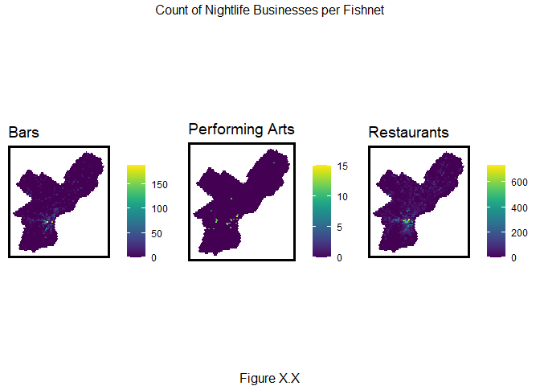
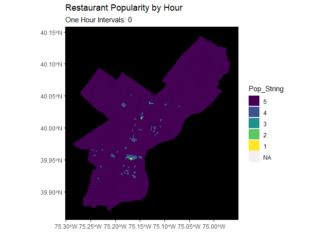
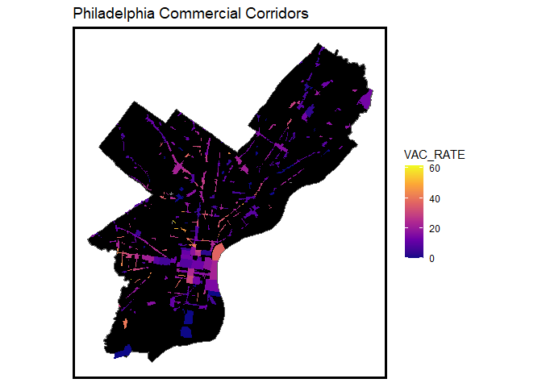
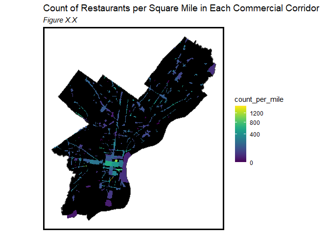
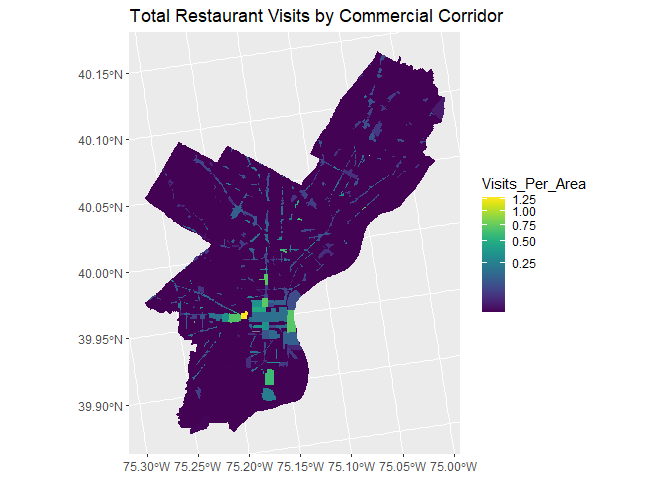
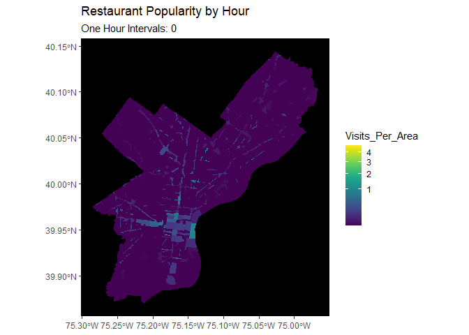
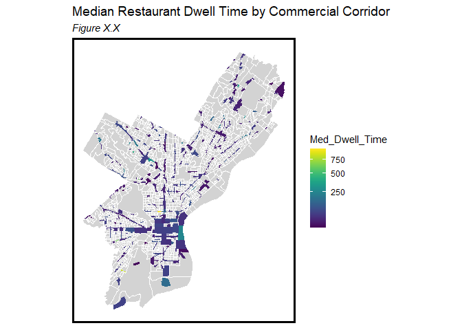
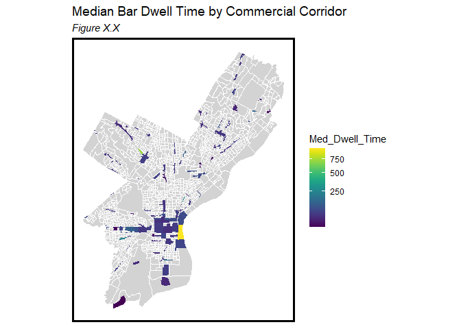
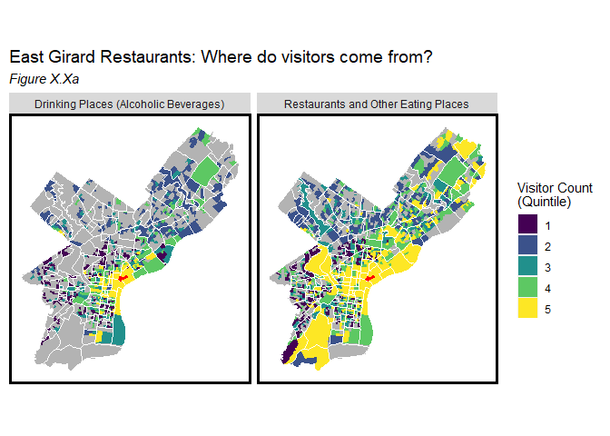
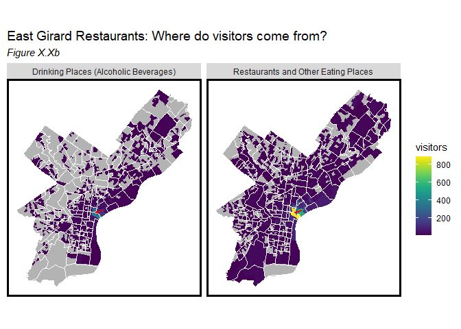

MUSA Practicum Nighttime Economy: Exploratory Analysis
================
Maddy Kornhauser, Brian Rawn, Sabrina Lee
3/2/2021

  - [0. Weekly Updates 3/2/2021](#weekly-updates-322021)
  - [1. Use Case Development](#use-case-development)
      - [Purpose](#purpose)
      - [The Tool](#the-tool)
      - [Applications](#applications)
  - [2. The SafeGraph Dataset](#the-safegraph-dataset)
  - [3. Exploratory Data Analysis](#exploratory-data-analysis)
      - [Philadelphia nightlife
        establishments](#philadelphia-nightlife-establishments)
      - [Nightlife hours](#nightlife-hours)
      - [Trip Flows](#trip-flows)
          - [Origins & destinations](#origins-destinations)
          - [Philadelphia visitor
            origins](#philadelphia-visitor-origins)
          - [Philadelphia destinations](#philadelphia-destinations)
      - [Nightlife corridors in
        Philadelphia](#nightlife-corridors-in-philadelphia)
      - [Neighborhood and corridor
        comparisons](#neighborhood-and-corridor-comparisons)
  - [4. Next Steps](#next-steps)

# 0\. Weekly Updates 3/2/2021

This week, we worked to incorporate instructor feedback into our EDA. In
particular we focused on the following areas:

  - Tailoring our EDA use case more specific to the economic development
    focus and continuing to build out metricss useful to economic
    development officials.
  - Discussing a predictive use case.
  - Build on the EDA to incorporate the origin/destination aspect of the
    data through flow maps.

# 1\. Use Case Development

## Purpose

Our goal is to help business improvement districts (BIDs) and small
businesses understand the patterns of nightlife across Philadelphia’s
commercial corridors in order to further recovery efforts following the
COVID-19 pandemic.

## The Tool

An interactive data dashboard that allows users to understand nightlife
patterns at the corridor level across Philadelphia. This dashboard
would, for each corridor, answer the questions of “who, what, where, and
when?” of nightlife visitors. The dashboard would also allow for
comparisons to other corridors. Potential metrics that would be
displayed include:

  - Corridor popularity (volume of trips) over time.
  - The percentage of visitors attributable to different origin census
    tracts and a breakdown of associated demographic characteristics.
  - Average distance traveled to restaurants/bars/theaters.
  - Average dwell time by commercial use.
  - The percentage drop in trips that restaurants/bars/theaters
    experienced as a result of COVID-19.
  - For each, a comparison to the average of other commercial corridors.

**(In progress)** In addition, the tool will have the additional
functionality of being able to predict the future popularity of a
commercial corridor given changes in time (hour, day, month), weather,
volume of commercial establishments (count or floor area), and retail
mix. This predictive functionality would help inform decisions relating
to the regulation and expansion of nightlife activities.

## Applications

How will this tool be utilized for economic development? Potential
applications include use by BIDs and small businesses to:

  - Understand peak trip times by use and location in order to inform
    parking, transit, or commercial policies.
  - Understand relative popularity of commercial corridors to inform
    decisions to grant licenses or small business assistance.
  - Understand origins and demographics of visitors to more effectively
    target marketing resources.
  - Understand the future effect of more commercial establishments or
    square footage in a given commercial corridor.

# 2\. The SafeGraph Dataset

Safegraph uses anonymized cell phone GPS data to record trips to
commercial points of interest. This data can tell us from where a trip
was made, what time the trip was made, and how long the individual
stated at the point of interest.

  - Pros:
      - Brand new dataset.
      - Lots of unexplored applications and potential insights
  - Cons:
      - Data is new and has a significant amount of incorrectly
        attributed trips, especially in urban areas

# 3\. Exploratory Data Analysis

``` r
dat <- read.csv("./data/moves_2018.csv")
phila <- st_read("./demo/phila.geojson")
```

    ## Reading layer `phila' from data source `C:\Users\mlkor\OneDrive\Documents\GitHub\musa_practicum_nighttime\demo\phila.geojson' using driver `GeoJSON'
    ## Simple feature collection with 20857 features and 28 fields
    ## geometry type:  POINT
    ## dimension:      XY
    ## bbox:           xmin: -75.27877 ymin: 39.87417 xmax: -74.95779 ymax: 40.13447
    ## geographic CRS: NAD83

``` r
dat2 <- dat %>% 
  dplyr::select(safegraph_place_id, 
                date_range_start, 
                date_range_end, 
                raw_visit_counts,
                raw_visitor_counts, 
                visits_by_day, 
                poi_cbg, 
                visitor_home_cbgs, 
                visitor_daytime_cbgs, 
                visitor_work_cbgs, 
                visitor_country_of_origin,
                distance_from_home, 
                median_dwell, 
                bucketed_dwell_times, 
                related_same_day_brand, 
                related_same_month_brand, 
                popularity_by_hour, 
                popularity_by_day, 
                device_type) %>%
  left_join(., phila, by = "safegraph_place_id") %>% 
  st_as_sf() %>%
  st_transform('ESRI:102728')

phl_cbg <- st_read("http://data.phl.opendata.arcgis.com/datasets/2f982bada233478ea0100528227febce_0.geojson", quiet = TRUE) %>%
  st_transform('ESRI:102728') %>%
  mutate(GEOID10 = as.numeric(GEOID10))
phl_zip <- st_read("http://data.phl.opendata.arcgis.com/datasets/b54ec5210cee41c3a884c9086f7af1be_0.geojson", quiet = TRUE) %>%
  st_transform('ESRI:102728') %>%
  mutate(CODE = as.numeric(CODE))
phl_nhoods <- 
  st_read("https://raw.githubusercontent.com/azavea/geo-data/master/Neighborhoods_Philadelphia/Neighborhoods_Philadelphia.geojson", quiet = TRUE) %>%
  st_transform('ESRI:102728') %>% 
  st_as_sf()
phl_corridors <- st_read("http://data.phl.opendata.arcgis.com/datasets/f43e5f92d34e41249e7a11f269792d11_0.geojson", quiet = TRUE) %>%
  st_transform('ESRI:102728')
```

## Philadelphia nightlife establishments

Our first research question is where Philadelphia nightlife
establishments are located across the city. The following maps indicate
where businesses that contribute to the city’s nightlife economy are
located. The categories include:

  - Bars (Drinking Places)
  - Restaurants
  - Hotels (Travel Accomodation)
  - Casinos (Gambling Industries)
  - Arts Venues (Promotes of Performing Arts)

Figure 3.1 below shows the spatial patterns of the business categories.
Bars and restaurants represent the highest number of businesses which
are spread across the city. Hotels are mostly clustered in the central
district of the city and near the airport in the southwest portion of
the city. There are far fewer casinos and arts venues.

Throughout the analysis, we pay special attention to bars and
restaurants, as these organizations are well distributed throughout the
city and apply to a local Philadelphia customer base.

``` r
dat2 %>%
  filter(top_category == "Drinking Places (Alcoholic Beverages)" |
           top_category == "Restaurants and Other Eating Places" |
           # top_category == "Traveler Accommodation" |
           # top_category == "Gambling Industries" |
           top_category == "Promoters of Performing Arts, Sports, and Similar Events" |
           top_category == "Performing Arts Companies") %>%
  ggplot() + 
  geom_sf(data = phl_cbg, fill = "grey80", color = "transparent") +
  geom_sf(color = "red", size = .1) +
  labs(title = "Location of Nightlife Establishments",
       subtitle = "Figure X.X") +
  facet_wrap(~top_category, nrow = 1) +
  mapTheme()
```


To look at the spatial patterns another way, we review the distribution
of businesses with a fishnet grid. The fishnet allows us to visualize
clusters and hotspots. Starting first with restaurants, Figure X.X below
demonstrates the spatial patterns of these businesses. Though
restaurants are well distributed throughout the city, there appears to
be a higher concentration of yellow cells (indicating a higher count of
restaurants) in the central part of the city. This corresponds to what
we observe in the point data analysis.

``` r
#Unnesting popularity by hour variable
dat_hour <- 
  dat2 %>% 
  select(safegraph_place_id, top_category, sub_category, popularity_by_hour, poi_cbg, median_dwell) %>%
  mutate(popularity_by_hour = str_remove_all(popularity_by_hour, pattern = "\\[|\\]")) %>%
  unnest(popularity_by_hour) %>%
  separate(.,
           popularity_by_hour,
           c("0", "1", "2", "3", "4", "5", "6", 
             "7", "8", "9", "10", "11", "12", 
             "13", "14", "15", "16", "17", "18",
             "19", "20", "21", "22", "23"),
           sep = ",") %>%
  pivot_longer(cols = 4:27,
               names_to = "Hour",
               values_to = "Count") %>%
  mutate(Hour = as.numeric(Hour),
         Count = as.numeric(Count))

#Creating a fishnet
phillyBoundary <- 
  phl_zip %>%
  select(geometry) %>%
  st_union() %>%
   st_transform('ESRI:102728') %>% 
  st_as_sf() 

fishnet <- 
  st_make_grid(phillyBoundary, cellsize = 1500, square = FALSE) %>%
  .[phillyBoundary] %>% #MK added this line
  st_sf() %>%
  mutate(uniqueID = rownames(.))

# #Plot fishnet
# ggplot() +
#   geom_sf(data = fishnet, fill = "#440255", color = "black")
```

Figure X.X below includes other sectors that contribute to
Philadelphia’s nightlife economy such as hotels and casinos. This
figure combines the fishnets into a single panel that allows us to
compare distribution of industries across business type.

``` r
#Filter restaurants
restaurants <- dat2 %>%
  filter(top_category == "Restaurants and Other Eating Places")%>%
    st_transform('ESRI:102728')%>%
  mutate(Legend = "Restaurants")

#aggregate restaurant count by fishnet cell
restaurants_net <-
  dplyr::select(restaurants) %>% 
  mutate(countRestaurants = 1) %>% 
  aggregate(., fishnet, sum) %>%
  mutate(countRestaurants = replace_na(countRestaurants, 0),
         uniqueID = rownames(.),
         cvID = sample(round(nrow(fishnet) / 24), 
                       size=nrow(fishnet), replace = TRUE))

#Bars
bars <- dat2 %>%
  filter(top_category == "Drinking Places (Alcoholic Beverages)")%>%
    st_transform('ESRI:102728')%>%
  mutate(Legend = "Bars")

#aggregate bars by fishnet cell
bars_net <-
  dplyr::select(bars) %>% 
  mutate(countBars = 1) %>% 
  aggregate(., fishnet, sum) %>%
  mutate(countBars = replace_na(countBars, 0),
         uniqueID = rownames(.),
         cvID = sample(round(nrow(fishnet) / 24), 
                       size=nrow(fishnet), replace = TRUE)) %>%
  mutate(Legend = "Bars")

# #Casinos
# casinos <- dat2 %>%
#   filter(top_category == "Gambling Industries") %>%
#   st_transform('ESRI:102728') %>%
#   mutate(Legend = "Casinos")
# 
# casinos_net <-
#   dplyr::select(casinos) %>% 
#   mutate(countCasinos = 1) %>% 
#   aggregate(., fishnet, sum) %>%
#   mutate(countCasinos = replace_na(countCasinos, 0),
#          uniqueID = rownames(.),
#          cvID = sample(round(nrow(fishnet) / 24), 
#                        size=nrow(fishnet), replace = TRUE))

#Performing arts
performingarts <- dat2 %>%
  filter(top_category == "Promoters of Performing Arts, Sports, and Similar Events" |
           top_category == "Performing Arts Companies") %>%
  st_transform('ESRI:102728') %>%
  mutate(Legend = "Performing Arts")

performingarts_net <-
  dplyr::select(performingarts) %>% 
  mutate(countPerformingarts = 1) %>% 
  aggregate(., fishnet, sum) %>%
  mutate(countPerformingarts = replace_na(countPerformingarts, 0),
         uniqueID = rownames(.),
         cvID = sample(round(nrow(fishnet) / 24), 
                       size=nrow(fishnet), replace = TRUE))

# #Hotels
# hotels <- dat2 %>%
#   filter(top_category == "Traveler Accommodation") %>%
#   st_transform('ESRI:102728') %>%
#   mutate(Legend = "Hotels")
# 
# hotels_net <-
#   dplyr::select(hotels) %>% 
#   mutate(countHotels = 1) %>% 
#   aggregate(., fishnet, sum) %>%
#   mutate(countHotels = replace_na(countHotels, 0),
#          uniqueID = rownames(.),
#          cvID = sample(round(nrow(fishnet) / 24), 
#                        size=nrow(fishnet), replace = TRUE))

# Combining fishnets into a single dataframe
vars_net <- 
  rbind(restaurants, 
        bars, 
        performingarts
        # , 
        # casinos, 
        # hotels
        ) %>%
  st_join(., fishnet, join=st_within) %>%
  st_drop_geometry() %>%
  group_by(uniqueID, Legend) %>%
  dplyr::summarize(count = n()) %>%
    full_join(fishnet) %>%
    spread(Legend,count, fill=0) %>%
    st_sf() %>%
    dplyr::select(-`<NA>`) %>%
    na.omit() %>%
    ungroup()

vars_net.long <- 
  gather(vars_net, Variable, value, -geometry, -uniqueID)

vars <- unique(vars_net.long$Variable)
mapList <- list()

#Plotting small multiple maps
for(i in vars){
  mapList[[i]] <- 
    ggplot() +
      geom_sf(data = filter(vars_net.long, Variable == i), aes(fill=value), colour=NA) +
      scale_fill_viridis(name="") +
      labs(title=i) +
      mapTheme()}

do.call(grid.arrange, c(mapList, ncol=3, top="Count of Nightlife Businesses per Fishnet", bottom = "Figure X.X"))
```



## Nightlife hours

Next, we explore when visitors make trips to nightlife establishments.
To do this, we worked with the popularity\_by\_hour SafeGraph variable,
which sums the total number of visitors by hour for each month.

Figure X.X shows the average foot traffic by business type over the
course of a day. This graphic indicates that though certain business
types are considererd part of the nightlife economy, they do not
exclusively experience traffic in the evenings. Restaurants are a good
example of this, where the data indicates that the highest levels of
traffic occur in the middle of the day. Arts venues, on the other hand,
have a clear patterns indicating that they are more popular later in the
day.

``` r
dat_hour %>%
  filter(top_category == "Drinking Places (Alcoholic Beverages)" |
           top_category == "Restaurants and Other Eating Places" |
           # top_category == "Traveler Accommodation" |
           # top_category == "Gambling Industries" |
           top_category == "Promoters of Performing Arts, Sports, and Similar Events" |
           top_category == "Performing Arts Companies") %>%
  group_by(Hour, top_category) %>%
  dplyr::summarize(Count = mean(Count)) %>%
  ggplot(., aes(x = Hour, y = Count)) + 
  geom_col() +
  labs(title = "Philadelphia Nightlife Organizations, Average Traffic by Hour",
       subtitle = "Figure X.X") +
  facet_wrap(~top_category, scales = "free") +
  plotTheme()
```


The following animation shows restaurant visitor counts by census block
group over the course of the day. We observe the highest amount of
traffic in center city in the middle of the day and then a resurgence of
traffic elsewhere in the city in the evening. This suggests that people
dine at neighborhood establishments close to their home in the evening.

``` r
dat_restaurants <-
  dat_hour %>%
  filter(top_category == "Restaurants and Other Eating Places") 

dat_restaurant_filter <-
  dat_restaurants %>%
  dplyr::rename(., GEOID10 = poi_cbg) %>%
  dplyr::group_by(GEOID10, Hour) %>%
  dplyr::summarize(Avg_Popularity = mean(Count),
            Total_Visits = sum(Count)) %>%
  left_join(phl_cbg) %>% 
  st_as_sf() %>%
  mutate(Visits_Per_Area = Total_Visits / Shape__Area * 100)

#Animation of restaurant popularity by hour
restaurant.animation.data <-
    dat_restaurant_filter %>%
    st_sf() %>%
    mutate(Pop_String = case_when(Visits_Per_Area < .4 ~ "5",
                              Visits_Per_Area >= .4 & Visits_Per_Area <.8 ~ "4",
                              Visits_Per_Area >= .8 & Visits_Per_Area <1.2 ~ "3",
                              Visits_Per_Area >= 1.2 & Visits_Per_Area <1.6 ~ "2",
                              Visits_Per_Area >= 2 ~ "1")) %>%
    mutate(Pop_String  = fct_relevel(Pop_String, "5","4","3","2","1"))

restaurant_animation <-
  ggplot() +
  geom_sf(data = phl_cbg, fill = "#440255", color = "transparent") +   
  geom_sf(data = restaurant.animation.data, aes(fill = Pop_String), color = "transparent") +
    scale_fill_manual(values = palette5) +
    labs(title = "Restaurant Popularity by Hour",
         subtitle = "One Hour Intervals: {current_frame}") +
  theme(panel.background = element_rect(fill = "black"),
         panel.grid.major = element_line(color = "transparent"),
          panel.grid.minor = element_line(colour = "transparent")) +
    transition_manual(Hour)
  

animate(restaurant_animation, duration=20, renderer = gifski_renderer())
```



The following animation shows the same metric for bars. We observe
traffic increasing throughout the day starting in the afternoon.

``` r
#Bar Analysis
#Filter Bars
dat_bars <- dat_hour %>%
  filter(top_category == "Drinking Places (Alcoholic Beverages)") 

#Merge CBGs with popularity by hour data
dat_bars_filter <-
  dat_bars %>%
  dplyr::rename(., GEOID10 = poi_cbg) %>%
  dplyr::group_by(GEOID10, Hour) %>%
  dplyr::summarize(Avg_Popularity = mean(Count),
            Total_Visits = sum(Count)) %>%
  left_join(phl_cbg) %>% 
  st_as_sf() %>%
  mutate(Visits_Per_Area = Total_Visits / Shape__Area * 100)

#Animation of bar popularity by hour
bar.animation.data <-
    dat_bars_filter %>%
    st_sf() %>%
    mutate(Pop_String = case_when(Visits_Per_Area == 0 ~ "5",
                              Visits_Per_Area > 0 & Visits_Per_Area <.2 ~ "4",
                              Visits_Per_Area >= .2 & Visits_Per_Area <.4 ~ "3",
                              Visits_Per_Area >= .4 & Visits_Per_Area <.6 ~ "2",
                              Visits_Per_Area >= .6 ~ "1")) %>%
    mutate(Pop_String  = fct_relevel(Pop_String, "5","4","3","2","1"))

bar_animation <-
  ggplot() +
  geom_sf(data = phl_cbg, fill = "#440255", color = "transparent", ) +
  geom_sf(data = bar.animation.data, aes(fill = Pop_String), color = "transparent") +
    scale_fill_manual(values = palette5) +
    labs(title = "Bar Popularity by Hour",
         subtitle = "One Hour Intervals: {current_frame}") +
  theme(panel.background = element_rect(fill = "black"),
         panel.grid.major = element_line(color = "transparent"),
          panel.grid.minor = element_line(colour = "transparent")) +
    transition_manual(Hour)

animate(bar_animation, duration=20, renderer = gifski_renderer())
```


## Trip Flows

### Origins & destinations

The SafeGraph data fundamentally captures flow of people across space by
connecting a series of origins and destinations. By mapping the origins
and destinations of trips taking place across Philadlephia, we can
observe which regions of the city draw from a larger crowd across the
city, and which areas cater to a more local population.

The following maps look at the origins and destinations for trips to
restaurants, bars, and arts venues across the city. Specifically, it
shows the distance between the centroid of the origin CBG to the
centroid of the destination CBG. The trips are grouped by commercial
corridor district as defined by the [Philadelphia corridor
shapefile](https://metadata.phila.gov/#home/datasetdetails/564236a55737e1f263ae5e3f/representationdetails/56423a4e902dbdd813db9a55/)).
The code draws each line segments based on lat/long coordinates of the
origin an destination centroid (could not get this to work with
projected data). Note that trips to destinations located outside of the
commercial corridors are left off of these maps.

Going forward, we would like to simplifyy these maps and show all
destinations as the centroid of the relevant commercial corridor.

The following code block loads unprojected shapefiles for the block
groups and city boundary as well as wrangle the data into a list of
individual origins and destinations for nightlife-related businesses.

``` r
phl_cbg_unproj <- st_read("http://data.phl.opendata.arcgis.com/datasets/2f982bada233478ea0100528227febce_0.geojson", quiet = TRUE) %>%
  mutate(GEOID10 = as.numeric(GEOID10),
         Lat = as.numeric(INTPTLAT10),
         Lon = as.numeric(INTPTLON10))

PHL_boundary_unproj <- st_read("https://opendata.arcgis.com/datasets/405ec3da942d4e20869d4e1449a2be48_0.geojson", quiet = TRUE)

flows <- dat2 %>%
  filter(top_category == "Drinking Places (Alcoholic Beverages)" |
           top_category == "Restaurants and Other Eating Places" |
           top_category == "Traveler Accommodation" |
           top_category == "Gambling Industries" |
           top_category == "Promoters of Performing Arts, Sports, and Similar Events" |
           top_category == "Performing Arts Companies") %>%
  st_join(phl_corridors) %>% #join to phl corridor shapefile
  st_join(phl_nhoods) %>% #join to neighborhood shapefile
  st_as_sf() %>%
  st_drop_geometry()%>%
  select(safegraph_place_id, 
         date_range_start,
         top_category,
         poi_cbg, 
         visitor_home_cbgs,
         NAME.y,
         P_DIST,
         name) %>%
  mutate(visitor_home_cbgs = str_remove_all(visitor_home_cbgs, pattern = "\\[|\\]")) %>%
  mutate(visitor_home_cbgs = str_remove_all(visitor_home_cbgs, pattern = "\\{|\\}")) %>%
  mutate(visitor_home_cbgs = str_remove_all(visitor_home_cbgs, pattern = '\\"|\\"')) %>%
  mutate(visitor_home_cbgs = str_split(visitor_home_cbgs, pattern = ",")) %>%
  unnest(visitor_home_cbgs) %>%
  separate(.,
           visitor_home_cbgs,
           c("visitor_cbg", "count"),
           sep = ":") %>%
  mutate(count = as.numeric(count),
         visitor_cbg = as.numeric(visitor_cbg)) %>%
  dplyr::rename(., corridor = NAME.y,
                corridor_dist = P_DIST,
                neighborhood = name)

cbg_list <- dplyr::pull(phl_cbg, GEOID10) #Generate list of PHL GEOIDs
flows <- flows[ flows$visitor_cbg %in% cbg_list, ] #Remove non Philly CBGs

flows <- left_join(flows, phl_cbg_unproj, by=c("visitor_cbg"="GEOID10")) %>%
  left_join(., phl_cbg_unproj, by = c("poi_cbg" = "GEOID10")) %>% #join unproj cbg data
  dplyr::mutate(origin_centroid = st_centroid(geometry.x),
                dest_centroid = st_centroid(geometry.y)) %>% #cacluate centroid
  select(safegraph_place_id, 
         top_category, 
         date_range_start,
         poi_cbg, 
         visitor_cbg, 
         count, 
         corridor,
         corridor_dist,
         neighborhood, 
         origin_centroid,
         dest_centroid) #select columns

flows <- flows %>% #split point data into lat and long columns
  mutate(lat.origin = unlist(map(flows$origin_centroid,1)),
         long.origin = unlist(map(flows$origin_centroid,2)),
         lat.dest = unlist(map(flows$dest_centroid,1)),
         long.dest = unlist(map(flows$dest_centroid,2)),
         id = as.character(c(1:nrow(.))))

PHL_boundary_unproj <- PHL_boundary_unproj %>% st_coordinates() # split out coordinates 
PHL_boundary_unproj <-as.data.frame(PHL_boundary_unproj) # save as dataframe
```

Figure X.X maps the trips to restaurants by district. The color,
transparency and width of the lines correspond to the number of trips to
each district. To improve the readability of the maps, we have only
shown data from June 2018.

``` r
#Restaurants by corridor District
flows %>% 
  filter(top_category == "Restaurants and Other Eating Places",
         date_range_start == "2018-06-01T04:00:00Z") %>%
  drop_na(corridor_dist) %>%
  ggplot() + 
  geom_polygon(data = PHL_boundary_unproj, aes(x=X, y=Y)) +
  geom_segment(aes(x = lat.origin, y = long.origin, xend = lat.dest, yend = long.dest, 
                   alpha=count, color=count)) +
  scale_colour_distiller(palette="Blues", name="Count", guide = "colorbar") +
  coord_equal() +
  facet_wrap(~corridor_dist, ncol = 6) +
  mapTheme() + 
  labs(title = "Restaurant Trips by Corridor District, June 2018",
       subtitle = "Figure X.X")
```


Figure X.X maps trips to bars by districts. As with bars, this is only
data from June 2018.

``` r
#Bars by Corridor Districts
flows %>% 
  filter(top_category == "Drinking Places (Alcoholic Beverages)",
         date_range_start == "2018-06-01T04:00:00Z") %>%
  drop_na(corridor_dist) %>%
  ggplot() + 
  geom_polygon(data = PHL_boundary_unproj, aes(x=X, y=Y), fill = "grey80") +
  geom_segment(aes(x = lat.origin, y = long.origin, xend = lat.dest, yend = long.dest, 
                   color=count, size=count, alpha=count)) +
  scale_colour_distiller(palette="Reds", name="Count", guide = "colorbar") +
  coord_equal() +
  facet_wrap(~corridor, ncol = 6) +
  mapTheme() + 
  labs(title = "Bar Trips by District, June 2018",
       sbutitle = "Figure X.X")
```


Finally, Figure X.X maps trips to arts venues by districts from June
2018. Since there are far fewer arts locations in the city, this graphic
only shows 4 districts where people travel to such establishments.

``` r
#Art Venues by corridor District
flows %>% 
  filter(top_category == "Promoters of Performing Arts, Sports, and Similar Events" |
           top_category == "Performing Arts Companies",
         date_range_start == "2018-06-01T04:00:00Z") %>%
  drop_na(corridor_dist) %>%
  ggplot() + 
  geom_polygon(data = PHL_boundary_unproj, aes(x=X, y=Y), fill = "grey80") +
  geom_segment(aes(x = lat.origin, y = long.origin, xend = lat.dest, yend = long.dest, 
                   color=count, alpha=count)) +
  scale_colour_distiller(palette="Greens", name="Count", guide = "colorbar") +
  coord_equal() +
  facet_wrap(~corridor_dist, ncol = 2) +
  mapTheme() + 
  labs(title = "Trips to Arts Venues by Corridor District, June 2018",
       subtitle = "Figure X.X")
```



These maps are works in progress and we would love feedback on how to
improve the readability.

### Philadelphia visitor origins

Next we explore where visitors come from. Separated by nightlife
establishment type, Figures X.Xa and X.Xb shows the average distance
travelled from each census block group. The distance is calculated by
measuring the euclidean distance between the centroid of each origin
block group and the destination. Then we calculate the weighted mean of
the distance travelled to account for destinations that people in a
given block group visit more frequently.

For business types that are well-dispersed throughout the city, such as
bars and restaurants, it appears that visitors typically travel shorter
distances. For business types with fewer destinations, such as casinos,
or that are clusters in specific areas of the city, such as hotels, it
is common for visitors to make longer trips to these destinations.

``` r
#Preparing dataset to split out by individual cbgs
dat_cbg <- 
  dat2 %>%
  select(safegraph_place_id, 
         date_range_start, 
         top_category, 
         sub_category, 
         poi_cbg, 
         visitor_home_cbgs, 
         geometry) %>%
  mutate(visitor_home_cbgs = str_remove_all(visitor_home_cbgs, pattern = "\\[|\\]")) %>%
  mutate(visitor_home_cbgs = str_remove_all(visitor_home_cbgs, pattern = "\\{|\\}")) %>%
  mutate(visitor_home_cbgs = str_remove_all(visitor_home_cbgs, pattern = '\\"|\\"')) %>%
  mutate(visitor_home_cbgs = str_split(visitor_home_cbgs, pattern = ",")) %>%
  unnest(visitor_home_cbgs) %>%
  separate(.,
           visitor_home_cbgs,
           c("Visitor_CBG", "Visitors"),
           sep = ":") %>%
  mutate(Visitor_CBG = as.numeric(Visitor_CBG),
         poi_cbg = as.numeric(poi_cbg),
         Visitors = as.numeric(Visitors))

cbg_origin <- #takes a really long time!
  dat_cbg %>%
  filter(top_category == "Drinking Places (Alcoholic Beverages)" |
           top_category == "Restaurants and Other Eating Places" |
           top_category == "Traveler Accommodation" |
           top_category == "Gambling Industries" |
           top_category == "Promoters of Performing Arts, Sports, and Similar Events" |
           top_category == "Performing Arts Companies") %>% #filter for nightlife establishments
  st_drop_geometry() %>% #drop geometry to join with cbg file
  dplyr::rename(., GEOID10 = Visitor_CBG) %>% #renaming to match cbg file
  left_join(phl_cbg, by = "GEOID10") %>% # join to cbg file
  select(safegraph_place_id, 
         poi_cbg, 
         GEOID10, 
         Visitors, 
         geometry) %>% #clean up dataset
  rename(., cbg_origin = GEOID10, #clean up column names
         cbg_dest = poi_cbg,
         geometry_origin = geometry) %>%
  left_join(phila, by = "safegraph_place_id") %>% #join back to the SafeGraph locations
  select(safegraph_place_id, 
         top_category, 
         sub_category, 
         cbg_dest, 
         cbg_origin, 
         Visitors, 
         geometry_origin, 
         geometry) %>%
  rename(., geometry_dest = geometry) %>%
  drop_na(geometry_origin) %>% #removing geometries that didn't match (ie outside philily)
  mutate(distance = mapply(st_distance, st_centroid(geometry_origin), geometry_dest)) #calculate distance
```

### Philadelphia destinations

Next, we study how far do Philadelphia visitors travel to nightlife
establishemnts. These maps show the average distance travelled to each
destination. Similar to the above, distance travelled is calculated by
meauring the euclidena distance from each destination to the centroid of
each visitor’s block group. The metric shown here represented the
weighted average of trips and distances.

In general, we see that visitors travel further to Center City
destinations. Importantly, these graphics exclude all trips that
originate outside of Philadelphia.

``` r
cbg_dest <-
  dat_cbg %>%
  filter(top_category == "Drinking Places (Alcoholic Beverages)" |
           top_category == "Restaurants and Other Eating Places" |
           top_category == "Traveler Accommodation" |
           top_category == "Gambling Industries" |
           top_category == "Promoters of Performing Arts, Sports, and Similar Events" |
           top_category == "Performing Arts Companies") %>%
  st_drop_geometry() %>%
  rename(., GEOID10 = Visitor_CBG) %>%
  left_join(phl_cbg, by = "GEOID10") %>%
  select(safegraph_place_id, 
         GEOID10, 
         poi_cbg, 
         Visitors, 
         geometry) %>%
  rename(., cbg_origin = GEOID10,
         geometry_origin = geometry,
         cbg_dest = poi_cbg) %>%
  left_join(phila, by = "safegraph_place_id") %>%
  select(safegraph_place_id, 
         top_category, 
         sub_category, 
         cbg_origin, 
         cbg_dest, 
         Visitors, 
         geometry_origin, 
         geometry) %>%
  rename(., geometry_dest = geometry) %>%
  drop_na(geometry_origin) %>% #dropping origins outside of philadelphia
  mutate(distance = mapply(st_distance, st_centroid(geometry_origin), st_centroid(geometry_dest)))
```

``` r
#Continuous
cbg_dest %>%
  group_by(safegraph_place_id, top_category) %>%
  summarize(avg_distance = weighted.mean(distance, Visitors)) %>%
  dplyr::select(safegraph_place_id, avg_distance) %>%
  left_join(phila, by = "safegraph_place_id") %>%
  st_as_sf() %>%
  ggplot() +
  geom_sf(data = phl_cbg, fill = "grey70", color = "transparent") +
  geom_sf(aes(color = avg_distance), size = 1) + 
  scale_fill_viridis(aesthetics = "color") +
  mapTheme() +
  labs(title = "Which nightlife destinations do visitors travel the furthest?",
       subtitle = "Figure X.Xa") +
  facet_wrap(~top_category)
```


``` r
#Quintile
cbg_dest %>%
  group_by(safegraph_place_id, top_category) %>%
  summarize(avg_distance = weighted.mean(distance, Visitors)) %>%
  dplyr::select(safegraph_place_id, avg_distance) %>%
  left_join(phila, by = "safegraph_place_id") %>%
  st_as_sf() %>%
  ggplot() +
  geom_sf(data = phl_cbg, fill = "grey70", color = "transparent") +
  geom_sf(aes(color = q5(avg_distance)), size = 1) + 
  scale_fill_manual(values = palette5,
                    aesthetics = c("colour", "fill"),
                    name = "Average Distance \n(Quintile)") +
  mapTheme() +
  labs(title = "Which nightlife destinations do visitors travel the farthest?",
       subtitle = "Figure X.Xb") +
  facet_wrap(~top_category)
```


## Nightlife corridors in Philadelphia

Next, we observe foot traffic along Philadelphia’s commercial corridors.
This analysis relies on a shapefile from the City of Philadelphia’s
Planning department which demarcates individual corridors and districts
throughout the city. According to the [available
metadata](https://metadata.phila.gov/#home/datasetdetails/564236a55737e1f263ae5e3f/representationdetails/56423a4e902dbdd813db9a55/)
“locations range from large, regional and specialty destinations to
corridors that reflect the evolving economy, culture, and aesthetic
traditions of surrounding neighborhoods.” This means that the
gegoraphies vary in size and character.

Figure X.X below maps the commercial corridors and shows the
corridor-wide vacancy rate, which varies from close to 0% to upwards of
60% throughout the city. Smaller corridors in far West Philadelphia,
North Philadelphia tend to have the highest vacancy rates.

``` r
###Corridors
#Load Philadelphia commercial corridors dataset and transform
corridors <- phl_corridors

dat_restaurants <-
dat_hour %>%
  filter(top_category == "Restaurants and Other Eating Places") 

corridors_filter <- corridors %>%
  select(OBJECTID, NAME, GLA, P_DIST, ST_EXT, PT_ADD, VAC_RATE) %>%
  mutate(VAC_RATE = str_remove_all(VAC_RATE, pattern = "%")) %>%
  mutate(VAC_RATE = as.numeric(VAC_RATE)) %>%
  st_as_sf() %>%
  st_transform('ESRI:102271') 
  
# Plot commercial corridors with colors as vacancy rate
ggplot() +
  geom_sf(data = phillyBoundary, fill = "black") +
  geom_sf(data = corridors_filter, aes(fill = VAC_RATE), color = "transparent") +
  scale_fill_viridis_c(option = "plasma") +
  labs(title = "Philadelphia Commercial Corridors") + 
  mapTheme()
```



Figure X.X below breaks down the count of restaunts in a given corridor
per square miile. We find that central corridors and districts tend to
have more restaurants per square mile. Other corridors. That said,
corridors across the city have a high concentration of restaurants as
well.

``` r
###Restaurants (takes a really long time)
dat_restaurants_grid <- dat_restaurants %>%
  select(geometry) %>%
  na.omit() %>%
  st_as_sf() %>%
  st_transform('ESRI:102271') %>% 
    distinct()

#Merge restaurants with commercial corridors 
corridors_restaurants <- 
  dplyr::select(dat_restaurants_grid) %>% 
  mutate(countRestaurant = 1) %>% 
  aggregate(., corridors_filter, sum) %>%
  mutate(countRestaurant = replace_na(countRestaurant, 0),
         uniqueID = rownames(.),
         area = st_area(geometry) * .00000038610,
         count_per_mile = as.numeric(countRestaurant / area),
         cvID = sample(round(nrow(corridors_filter) / 24), size=nrow(corridors_filter), replace = TRUE))

#Plot map of number of restaurants per square mile
ggplot() +
  geom_sf(data = phillyBoundary, fill = "black") +
  geom_sf(data = corridors_restaurants, aes(fill = count_per_mile), color = "transparent") +
  scale_fill_viridis(trans = "sqrt") +
  labs(title = "Count of Restaurants per Square Mile in Each Commercial Corridor",
       subtitle = "Figure X.X") +
  mapTheme()
```


Restaurant animations

``` r
#Create animated map of number of restaurant trips by corridor per hour
dat_restaurants_cord <- dat_restaurants %>%
  st_as_sf() %>%
  st_transform('ESRI:102271') 

dat_corridors_restaurants <-
  st_join(corridors_filter, dat_restaurants_cord, ) %>% 
  group_by(NAME, GLA, Hour) %>%
  summarize(
            Avg_Popularity = mean(Count),
            Total_Visits = sum(Count),
            Med_Dwell_Time = mean(median_dwell)) %>%
  st_as_sf() 

dat_corridors_restaurants <- dat_corridors_restaurants %>%
  mutate(
    GLA = as.numeric(gsub(",", "", GLA)),
    Visits_Per_Area = Total_Visits / GLA * 5)

#Plot of restaurant popularity between 7 and 8pm
dat_corridors_restaurants %>%
  subset(Hour == 19) %>% #selecting for nighttime hours
  ggplot() + 
  geom_sf(data = phl_cbg, fill = "#440255", color = "transparent") +
  geom_sf(aes(fill = Visits_Per_Area), color = "transparent") + 
  scale_fill_viridis(trans = "sqrt") +
  labs(title = "Total Restaurant Visits by Commercial Corridor") 
```



``` r
#Animation of restaurant popularity by hour
restaurant.corr.animation.data <-
    dat_corridors_restaurants %>%
    st_sf() %>%
    mutate(Pop_String = case_when(Visits_Per_Area < .4 ~ "5",
                              Visits_Per_Area >= .4 & Visits_Per_Area <.8 ~ "4",
                              Visits_Per_Area >= .8 & Visits_Per_Area <1.2 ~ "3",
                              Visits_Per_Area >= 1.2 & Visits_Per_Area <1.6 ~ "2",
                              Visits_Per_Area >= 2 ~ "1")) %>%
    mutate(Pop_String  = fct_relevel(Pop_String, "5","4","3","2","1"))

restaurant_corr_animation <-
  ggplot() +
  geom_sf(data = phl_cbg, fill = "#440255", color = "transparent") +   
  geom_sf(data = restaurant.corr.animation.data, aes(fill = Visits_Per_Area), color = "transparent") +
     scale_fill_viridis(trans = "sqrt") +
    labs(title = "Restaurant Popularity by Hour",
         subtitle = "One Hour Intervals: {current_frame}") +
  theme(panel.background = element_rect(fill = "black"),
         panel.grid.major = element_line(color = "transparent"),
          panel.grid.minor = element_line(colour = "transparent")) +
    transition_manual(Hour)

animate(restaurant_corr_animation, duration=20, renderer = gifski_renderer())
```



Figure X.X shows the number of bars in each commercial corridor per
square mile. Again, we see the corridors around Center City generally
showing a higher concentration of bars.

``` r
###Bars
dat_bars_grid <- dat_bars %>%
  select(geometry) %>%
  #na.omit() %>%
  st_as_sf() %>%
  st_transform('ESRI:102271') %>%
    distinct()

###Bars
corridors_bars <- 
  dplyr::select(dat_bars_grid) %>% 
  mutate(countBar = 1) %>% 
  aggregate(., corridors_filter, sum) %>%
  mutate(countBar = replace_na(countBar, 0),
         uniqueID = rownames(.),
         area = st_area(geometry) * .00000038610,
         count_per_mile = as.numeric(countBar / area),
         cvID = sample(round(nrow(corridors_filter) / 24), size=nrow(corridors_filter), replace = TRUE))

#Plot map of number of bars per square mile
ggplot() +
  geom_sf(data = phillyBoundary, fill = "black") +
  geom_sf(data = corridors_bars, aes(fill = count_per_mile), color = "transparent") +
  scale_fill_viridis(trans = "sqrt") +
  labs(title = "Count of Bars per Square Mile in Each Commercial Corridor", 
       subtitle = "Figure X.X") +
  mapTheme()
```


``` r
#Create animated map of number of bar trips by corridor per hour
dat_bars_cord <- dat_bars %>%
  st_as_sf() %>%
  st_transform('ESRI:102271') 

dat_corridors_bars <-
  st_join(corridors_filter, dat_bars_cord, ) %>% 
  group_by(NAME, GLA, Hour) %>%
  summarize(Avg_Popularity = mean(Count),
            Total_Visits = sum(Count),
            Med_Dwell_Time = mean(median_dwell)) %>%
  st_as_sf() 

dat_corridors_bars <- dat_corridors_bars %>%
  mutate(
    GLA = as.numeric(gsub(",", "", GLA)),
    Visits_Per_Area = Total_Visits / GLA * 5)

#Plot of bar popularity between 7 and 8pm
dat_corridors_bars %>%
  subset(Hour == 19) %>% #selecting for nighttime hours
  ggplot() + 
  geom_sf(data = phl_cbg, fill = "#440255", color = "transparent") +
  geom_sf(aes(fill = Visits_Per_Area), color = "transparent") + 
  scale_fill_viridis(trans = "sqrt") +
  labs(title = "Total Bar Visits by Commercial Corridor") 
```


``` r
#Animation of bar popularity by hour
bar.corr.animation.data <-
    dat_corridors_bars %>%
    st_sf() %>%
    mutate(Pop_String = case_when(Visits_Per_Area < .4 ~ "5",
                              Visits_Per_Area >= .4 & Visits_Per_Area <.8 ~ "4",
                              Visits_Per_Area >= .8 & Visits_Per_Area <1.2 ~ "3",
                              Visits_Per_Area >= 1.2 & Visits_Per_Area <1.6 ~ "2",
                              Visits_Per_Area >= 2 ~ "1")) %>%
    mutate(Pop_String  = fct_relevel(Pop_String, "5","4","3","2","1"))

bar_corr_animation <-
  ggplot() +
  geom_sf(data = phl_cbg, fill = "#440255", color = "transparent") +   
  geom_sf(data = bar.corr.animation.data, aes(fill = Visits_Per_Area), color = "transparent") +
     scale_fill_viridis(trans = "sqrt") +
    labs(title = "Bar Popularity by Hour",
         subtitle = "One Hour Intervals: {current_frame}") +
  theme(panel.background = element_rect(fill = "black"),
         panel.grid.major = element_line(color = "transparent"),
          panel.grid.minor = element_line(colour = "transparent")) +
    transition_manual(Hour)

animate(bar_corr_animation, duration=20, renderer = gifski_renderer())
```


\#\# Dwell times

The following Figures look at the median dwell time by bars and
restaurants per commercial corridor.

``` r
#Restaurant data
dat_corridors_restaurants <-
  st_join(corridors_filter, dat_restaurants_cord, ) %>% 
  group_by(NAME, GLA, Hour) %>%
  summarize(
            Avg_Popularity = mean(Count),
            Total_Visits = sum(Count),
            Med_Dwell_Time = mean(median_dwell)) %>%
  st_as_sf() 

dat_corridors_restaurants <- dat_corridors_restaurants %>%
  mutate(
    GLA = as.numeric(gsub(",", "", GLA)),
    Visits_Per_Area = Total_Visits / GLA * 5)

#Plot of restaurant median dwell time 
dat_corridors_restaurants %>%
  subset(Hour == 19) %>% #selecting for nighttime hours
  ggplot() + 
  geom_sf(data = phl_cbg, fill = "light gray", color = "white") +
  geom_sf(aes(fill = Med_Dwell_Time), color = "transparent") + 
  scale_fill_viridis(trans = "sqrt") +
  labs(title = "Median Restaurant Dwell Time by Commercial Corridor",
       subtitle = "Figure X.X") +
  mapTheme()
```



``` r
#Plot of bar median dwell time 
dat_corridors_bars %>%
  subset(Hour == 19) %>% #selecting for nighttime hours
  ggplot() + 
  geom_sf(data = phl_cbg, fill = "light gray", color = "white") +
  geom_sf(aes(fill = Med_Dwell_Time), color = "transparent") + 
  scale_fill_viridis(trans = "sqrt") +
  labs(title = "Median Bar Dwell Time by Commercial Corridor",
       subtitle = "Figure X.X") +
  mapTheme()
```



## Neighborhood and corridor comparisons

Finally, we began exploring businesses at the corridor level and
understand how different corridors attract different visitors from
across the city. We plan to systematically expand the scope of this
study to other corridors across the city. We also believe that this data
is particularly relevant to business and economic development
professionals in the COVID-19 recovery efforts.

Using the Commercial Corridor shapefile available on Open Data Philly,
we selected two corridors to compare: East Girard Avenue, a central
corridor in the Fishtown neighborhood, and West Girard Avenue in
Brewerytown.

``` r
#East Girard Corridor
EastGirard_corr <- 
  phl_corridors %>% 
  filter(NAME == "East Girard") %>% 
  st_as_sf()

dat_EGC <- dat2[EastGirard_corr,]

dat_EGC_cbg <- 
  dat_EGC %>%
  select(safegraph_place_id, 
         date_range_start, 
         top_category, 
         sub_category, 
         visitor_home_cbgs, 
         geometry) %>%
  mutate(visitor_home_cbgs = str_remove_all(visitor_home_cbgs, pattern = "\\[|\\]")) %>%
  mutate(visitor_home_cbgs = str_remove_all(visitor_home_cbgs, pattern = "\\{|\\}")) %>%
  mutate(visitor_home_cbgs = str_remove_all(visitor_home_cbgs, pattern = '\\"|\\"')) %>%
  mutate(visitor_home_cbgs = str_split(visitor_home_cbgs, pattern = ",")) %>%
  unnest(visitor_home_cbgs) %>%
  separate(.,
           visitor_home_cbgs,
           c("cbg_origin", "visitors"),
           sep = ":") %>%
  mutate(cbg_origin = as.numeric(cbg_origin),
         visitors = as.numeric(visitors)) %>%
  filter(top_category == "Drinking Places (Alcoholic Beverages)" |
           top_category == "Restaurants and Other Eating Places" |
           top_category == "Traveler Accommodation" |
           top_category == "Gambling Industries" |
           top_category == "Promoters of Performing Arts, Sports, and Similar Events" |
           top_category == "Performing Arts Companies") %>%
    mutate(corridor = "East Girard")

#West Girard
WestGirard_corr <- 
  phl_corridors %>% 
  filter(NAME == "West Girard") %>% 
  st_as_sf()

dat_WGC <- dat2[WestGirard_corr,]

dat_WGC_cbg <- 
  dat_WGC %>%
  select(safegraph_place_id, 
         date_range_start, 
         top_category, 
         sub_category, 
         visitor_home_cbgs, 
         geometry) %>%
  mutate(visitor_home_cbgs = str_remove_all(visitor_home_cbgs, pattern = "\\[|\\]")) %>%
  mutate(visitor_home_cbgs = str_remove_all(visitor_home_cbgs, pattern = "\\{|\\}")) %>%
  mutate(visitor_home_cbgs = str_remove_all(visitor_home_cbgs, pattern = '\\"|\\"')) %>%
  mutate(visitor_home_cbgs = str_split(visitor_home_cbgs, pattern = ",")) %>%
  unnest(visitor_home_cbgs) %>%
  separate(.,
           visitor_home_cbgs,
           c("cbg_origin", "visitors"),
           sep = ":") %>%
  mutate(cbg_origin = as.numeric(cbg_origin),
         visitors = as.numeric(visitors)) %>%
  filter(top_category == "Drinking Places (Alcoholic Beverages)" |
           top_category == "Restaurants and Other Eating Places" |
           top_category == "Traveler Accommodation" |
           top_category == "Gambling Industries" |
           top_category == "Promoters of Performing Arts, Sports, and Similar Events" |
           top_category == "Performing Arts Companies") %>%
  mutate(corridor = "West Girard")
```

Figures X.Xa and X.Xb show the volume of visitors to the East Girard
Corridor (outlined in red) by census block group. While visitors from
across the city frequent East Girard corridor, particularly for its
restaurants, Figure X.Xb clarifies that the corridor mostly caters to a
local customer base of surrounding census tracts.

Block groups shaded gray indicate that no resident made a trip to this
corridor.

``` r
dat_EGC_cbg %>%
  dplyr::group_by(cbg_origin, top_category) %>%
  dplyr::summarize(visitors = sum(visitors)) %>%
  st_drop_geometry() %>%
  dplyr::rename(., GEOID10 = cbg_origin) %>%
  left_join(phl_cbg, by = "GEOID10") %>%
  st_as_sf() %>%
  drop_na(geometry) %>% 
  ggplot() +
  geom_sf(data = phl_cbg, fill = "grey70", color = "transparent") +
  geom_sf(aes(fill = q5(visitors), geometry = geometry), color = "transparent") + 
  geom_sf(data = phl_nhoods, color = "white", fill = "transparent") +
  geom_sf(data = EastGirard_corr, color = "red", fill = "transparent", lwd = 1) +
  scale_fill_manual(values = palette5,
                    aesthetics = c("colour", "fill"),
                    name = "Visitor Count \n(Quintile)") +
  mapTheme() +
  labs(title = "East Girard Restaurants: Where do visitors come from?",
       subtitle = "Figure X.Xa") +
  facet_wrap(~top_category)
```



``` r
dat_EGC_cbg %>%
  dplyr::group_by(cbg_origin, top_category) %>%
  dplyr::summarize(visitors = sum(visitors)) %>%
  st_drop_geometry() %>%
  dplyr::rename(., GEOID10 = cbg_origin) %>%
  left_join(phl_cbg, by = "GEOID10") %>%
  st_as_sf() %>%
  drop_na(geometry) %>% 
  ggplot() +
  geom_sf(data = phl_cbg, fill = "grey70", color = "transparent") +
  geom_sf(aes(fill = visitors, geometry = geometry), color = "transparent") + 
  geom_sf(data = phl_nhoods, color = "white", fill = "transparent") +
  geom_sf(data = EastGirard_corr, color = "red", fill = "transparent", lwd = .5) +
  scale_fill_viridis() +
  mapTheme() +
  labs(title = "East Girard Restaurants: Where do visitors come from?",
       subtitle = "Figure X.Xb") +
  facet_wrap(~top_category)
```



Figures 3.12a and 3.12b show the volume of visitors to West Girard
corridor. While the corridor appears to draw visitors from fewer census
tracts overall, the corridor draws from a similarly local customer base
of the surrounding block groups.

As before, block groups shaded gray have no residents that made trips to
this corridor.

``` r
dat_WGC_cbg %>%
  dplyr::group_by(cbg_origin, top_category) %>%
  dplyr::summarize(visitors = sum(visitors)) %>%
  st_drop_geometry() %>%
  dplyr::rename(., GEOID10 = cbg_origin) %>%
  left_join(phl_cbg, by = "GEOID10") %>%
  st_as_sf() %>%
  drop_na(geometry) %>% 
  ggplot() +
  geom_sf(data = phl_cbg, fill = "grey70", color = "transparent") +
  geom_sf(aes(fill = q5(visitors), geometry = geometry), color = "transparent") + 
  geom_sf(data = phl_nhoods, color = "white", fill = "transparent") +
  geom_sf(data = WestGirard_corr, color = "red", fill = "transparent", lwd = 1) +
  scale_fill_manual(values = palette5,
                    aesthetics = c("colour", "fill"),
                    name = "Visitor Count \n(Quintile)") +
  mapTheme() +
  labs(title = "West Girard: Where do visitors come from?",
       subtitle = "Figure X.Xa") +
  facet_wrap(~top_category)
```


``` r
dat_WGC_cbg %>%
  dplyr::group_by(cbg_origin, top_category) %>%
  dplyr::summarize(visitors = sum(visitors)) %>%
  st_drop_geometry() %>%
  dplyr::rename(., GEOID10 = cbg_origin) %>%
  left_join(phl_cbg, by = "GEOID10") %>%
  st_as_sf() %>%
  drop_na(geometry) %>% 
  ggplot() +
  geom_sf(data = phl_cbg, fill = "grey70", color = "transparent") +
  geom_sf(aes(fill = visitors, geometry = geometry), color = "transparent") + 
  geom_sf(data = phl_nhoods, color = "white", fill = "transparent") +
  geom_sf(data = WestGirard_corr, color = "red", fill = "transparent", lwd = .5) +
  scale_fill_viridis() +
  mapTheme() +
  labs(title = "East Girard Restaurants: Where do visitors come from?",
       subtitle = "Figure X.Xb") +
  facet_wrap(~top_category)
```


We can further explore the individual corridor analysis by tying the
trip origins to census data. This allows us to construct a customer
profile of the people visiting specific corridors throughout the city.

``` r
phl_blockgroups <- 
  get_acs(geography = "block group", 
        variables = c("B01003_001E", 
                      "B02001_002E", 
                      "B01002_001E",
                      "B19013_001E", 
                      "B25064_001E"),
        year=2018, 
        state=42, 
        county=101, 
        geometry=T, 
        output = "wide") %>%
  st_transform('ESRI:102728')%>%
  rename(TotalPop = B01003_001E,
         Whites = B02001_002E,
         MedAge = B01002_001E,
         MedHHInc = B19013_001E,
         MedRent = B25064_001E,
         GEOID10 = GEOID) %>%
  dplyr::select(-NAME, -starts_with("B")) %>%
  mutate(pctWhite = ifelse(TotalPop > 0, Whites / TotalPop,0),
         GEOID10 = as.numeric(GEOID10)) %>%
  dplyr::select(-Whites) 
```

    ##   |                                                                              |                                                                      |   0%  |                                                                              |                                                                      |   1%  |                                                                              |=                                                                     |   1%  |                                                                              |==                                                                    |   2%  |                                                                              |==                                                                    |   3%  |                                                                              |==                                                                    |   4%  |                                                                              |===                                                                   |   4%  |                                                                              |===                                                                   |   5%  |                                                                              |====                                                                  |   6%  |                                                                              |=====                                                                 |   7%  |                                                                              |======                                                                |   8%  |                                                                              |======                                                                |   9%  |                                                                              |=======                                                               |  10%  |                                                                              |========                                                              |  11%  |                                                                              |=========                                                             |  12%  |                                                                              |=========                                                             |  13%  |                                                                              |==========                                                            |  14%  |                                                                              |==========                                                            |  15%  |                                                                              |===========                                                           |  15%  |                                                                              |============                                                          |  17%  |                                                                              |============                                                          |  18%  |                                                                              |=============                                                         |  19%  |                                                                              |==============                                                        |  20%  |                                                                              |===============                                                       |  21%  |                                                                              |===============                                                       |  22%  |                                                                              |================                                                      |  23%  |                                                                              |=================                                                     |  24%  |                                                                              |==================                                                    |  26%  |                                                                              |===================                                                   |  27%  |                                                                              |====================                                                  |  28%  |                                                                              |====================                                                  |  29%  |                                                                              |=====================                                                 |  30%  |                                                                              |======================                                                |  31%  |                                                                              |=======================                                               |  32%  |                                                                              |=======================                                               |  33%  |                                                                              |========================                                              |  34%  |                                                                              |========================                                              |  35%  |                                                                              |=========================                                             |  35%  |                                                                              |==========================                                            |  37%  |                                                                              |==========================                                            |  38%  |                                                                              |===========================                                           |  39%  |                                                                              |============================                                          |  40%  |                                                                              |=============================                                         |  41%  |                                                                              |=============================                                         |  42%  |                                                                              |==============================                                        |  43%  |                                                                              |===============================                                       |  44%  |                                                                              |================================                                      |  46%  |                                                                              |=================================                                     |  48%  |                                                                              |==================================                                    |  48%  |                                                                              |==================================                                    |  49%  |                                                                              |===================================                                   |  50%  |                                                                              |====================================                                  |  51%  |                                                                              |=====================================                                 |  52%  |                                                                              |=====================================                                 |  53%  |                                                                              |======================================                                |  54%  |                                                                              |=======================================                               |  55%  |                                                                              |========================================                              |  57%  |                                                                              |=========================================                             |  59%  |                                                                              |==========================================                            |  60%  |                                                                              |===========================================                           |  61%  |                                                                              |===========================================                           |  62%  |                                                                              |============================================                          |  63%  |                                                                              |=============================================                         |  64%  |                                                                              |==============================================                        |  65%  |                                                                              |==============================================                        |  66%  |                                                                              |===============================================                       |  68%  |                                                                              |================================================                      |  69%  |                                                                              |=================================================                     |  70%  |                                                                              |==================================================                    |  71%  |                                                                              |==================================================                    |  72%  |                                                                              |===================================================                   |  73%  |                                                                              |====================================================                  |  74%  |                                                                              |=====================================================                 |  75%  |                                                                              |======================================================                |  77%  |                                                                              |=======================================================               |  79%  |                                                                              |========================================================              |  80%  |                                                                              |=========================================================             |  81%  |                                                                              |=========================================================             |  82%  |                                                                              |==========================================================            |  83%  |                                                                              |===========================================================           |  84%  |                                                                              |============================================================          |  85%  |                                                                              |============================================================          |  86%  |                                                                              |=============================================================         |  87%  |                                                                              |=============================================================         |  88%  |                                                                              |==============================================================        |  88%  |                                                                              |===============================================================       |  90%  |                                                                              |===============================================================       |  91%  |                                                                              |================================================================      |  92%  |                                                                              |=================================================================     |  93%  |                                                                              |==================================================================    |  94%  |                                                                              |===================================================================   |  95%  |                                                                              |====================================================================  |  96%  |                                                                              |====================================================================  |  97%  |                                                                              |===================================================================== |  99%  |                                                                              |======================================================================| 100%

The below Figure X.X compares demographic indicators pulled from the
census across the two customer bases. East Girard corridor’s customer
base, shown in purple, tend to come from whiter census tracts with a
higher median household income and median rent. West Girard corridor’s
customer base tend to come from less white census tracts with lower
incomes and median rent. Both corridors, however, pull from census
tracts with a similar median age.

``` r
rbind(dat_EGC_cbg, dat_WGC_cbg) %>%
  rename(GEOID10 = cbg_origin) %>%
  dplyr::select(GEOID10, visitors, corridor) %>%
  st_drop_geometry() %>%
  left_join(phl_blockgroups, by = "GEOID10") %>%
  pivot_longer(.,
               cols = c("MedAge", "MedHHInc", "MedRent", "pctWhite"),
               names_to = "variable") %>%
  dplyr::select(GEOID10, corridor, visitors, variable, value) %>%
  ggplot(., aes(x = value, fill = corridor, weight = visitors)) + 
  geom_density(alpha = .5) +
  scale_fill_manual(values = palette3,
                    aesthetics = c("colour", "fill"),
                    name = "Visitor Count \n(Quintile)") +
  facet_wrap( ~ variable, scales = "free") +
  plotTheme() +
  labs(title = 'East Girard vs. West Girard Corridors',
       subtitle = "Figure X.X")
```


# 4\. Next Steps

We will continue our Exploratory Data Analysis and plan to focus on
defining features that will be useful for modeling.

  - Improving and simplifying the flow map.
  - Expanding analysis to the regional scale. Currently we only review
    trips originating within Phialdelphia, but it will be important to
    understand which districts have a more regional approach.
  - Understand how COVID-19 has impacted nightlife foot traffic in
    Philadelphia? Have corridors been impacted evenly?
